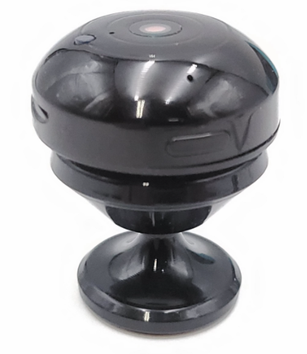
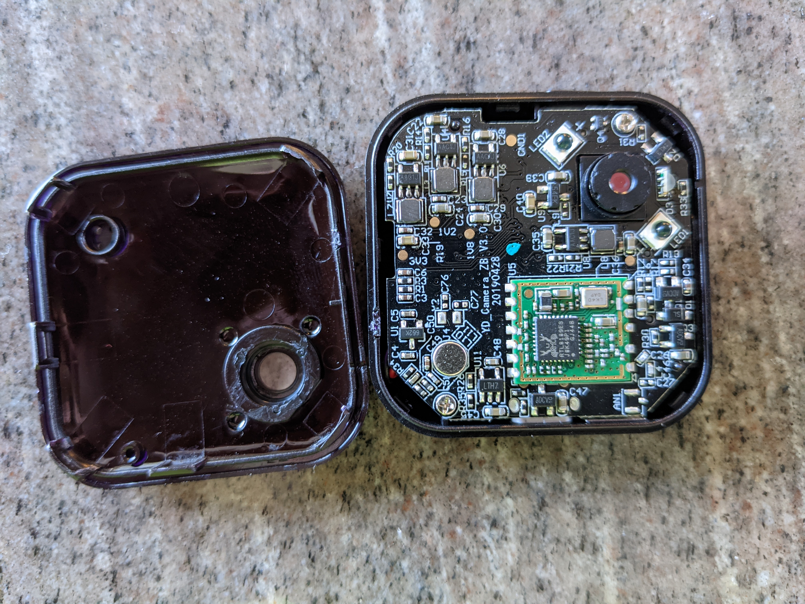
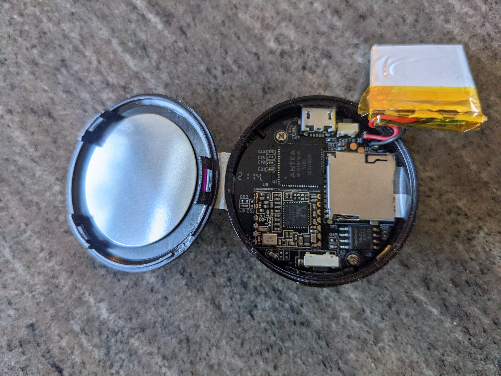
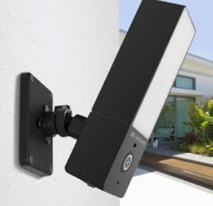

## Anyka AK3918E camera (OUCAM)

There are 3 models of the OUCAM so far, P1 P2 and an outdoor model that's no longer sold. They are all based on the Anyka AK3918E platform like many of these P2P cameras. They are set up and managed with the [OUCAM app](https://play.google.com/store/apps/details?id=cn.JK.P2PNetCamDv.oucam&hl=en_US&gl=US), but then operate like any other P2P camera.

| Model   | External image                | Inside                    |
|---------|-------------------------------|---------------------------|
| P1      |       |  |
| P2      |       |  |
| Outdoor |  | None                      |

These cameras seem similar the "v380" or "A9" cameras available everywhere for US$20.


### Platform

Detailed at [anyka's website](http://www.anyka.com/en/productInfo.aspx?id=109), and in the [specs](http://monitor.espec.ws/files/700cafec77419c2d7705f376c974b8d0ff72_986.pdf).

#### Features

CPU
* ARM926EJ-S core
* Memory Management Unit (MMU)

Camera Interface
* Supports 8/10/12-bit Raw YUV CMOS image sensors
* Compatible with BT.601 protocol
* Programmable capture frame-rate

Image Signal Processor (ISP)
* 3A (AE, AWB, AF)
* Gamma correction, color enhancement, and edge sharpening
* DPC, denoising, and false color suppression
* Lens correction, lens shape correction
* 2D/ 3D Noise Reduction
* Wide dynamic range（WDR)

Video Pre-processor
* Supports cut window
* Supports image scaling
* Supports On-screen Display (OSD) and timestamp
* Supports Privacy Mask

Video Encoder
* H.264 encoder
* JPEG encoder
* Supports dual streams output

ADC/DAC
* Sigma-Delta ADC for voice/music recording
* Sigma-Delta DAC for mono audio playback
* SAR ADC for battery voltage measurement, keypad, and general analog-to-digital conversion

Memory
* On-chip DDR2 SDRAM

Hardware Encryption
* AES, DES and 3DES engine

Ethernet MAC
* MII/RMII Interface
* 10/100Mbps, full-duplex mode

Peripheral Interfaces
* USB 2.0 Host & Slave
* TWI
* I2S
* SPI
* UART
* MMC/SD/SDIO
* PWM

Operating Voltage
* Core 1.2V
* I/O 3.3V
* DDR2 SDRAM 1.8V

Package
* QFNL80, ELQFP128

## Boot

Bootup and wifi association takes about 30seconds.

AK39 clocks: CPU 400MHz, MEM 200MHz, ASIC 100MHz

```
[root@anyka ~]$ cat /proc/cpuinfo
Processor       : ARM926EJ-S rev 5 (v5l)
BogoMIPS        : 199.06
Features        : swp half fastmult edsp java 
CPU implementer : 0x41
CPU architecture: 5TEJ
CPU variant     : 0x0
CPU part        : 0x926
CPU revision    : 5

Hardware        : Cloud39E_AK3918E+H42_V1.0.2
Revision        : 0000
Serial          : 0000000000000000
```

```
[root@anyka ~]$ cat /proc/version 
Linux version 3.4.35 (root@ubuntu) (gcc version 4.4.1 (Sourcery G++ Lite 2009q3-67) ) #25 Tue Nov 19 14:00:09 HKT 2019
-AKV_2.1.06
```

No FPU.

40MB memory, not sure what the mem=64m kernel arg is for...

Anyka software versions (anyka_ipc) I have:
* P1 model is 3.3.56
* P2 model is 3.3.5.2

The version of the camera is stored in `/etc/jffs2/anyka_cfg.ini` as `soft_version`.

Between the models I found slight differences in important files:

P1 model (round)
```
64615ca2c0c7133a199b675820c3143e  /etc/jffs2/isp_h62_qq.conf
7c22c5f7a5cd388cfd96fd8ae3e36178  /usr/bin/daemon
0e15052675fe0d0ddfc177c45cf020d6  /usr/sbin/anyka_ipc.sh
3049ef075964bde69b75218811d3b645  /usr/bin/anyka_ipc
```

P2 model (square)
```
64615ca2c0c7133a199b675820c3143e  /etc/jffs2/isp_h62_qq.conf
7c22c5f7a5cd388cfd96fd8ae3e36178  /usr/bin/daemon
0e15052675fe0d0ddfc177c45cf020d6  /usr/sbin/anyka_ipc.sh
bc6d796598f3520886e505cbf9177a67  /usr/bin/anyka_ipc
```

The P2 model doesn't seem to go into ircut mode automatically even when `ircut_mode = 0` (auto), which is the same as the setting on my P1s.

## Main binaries
[`daemon`](https://github.com/jingwenyi/SmartCamera/tree/master/source/daemon)
[`anyka_ipc`](https://github.com/jingwenyi/SmartCamera/tree/master/source/anyka_ipc)

Daemon actually uses more memory than anyka_ipc

```
    PID  PPID USER     STAT   VSZ %VSZ CPU %CPU COMMAND
  437     1 root     S    95164259.0   0 12.0 anyka_ipc
  528     2 root     SW       0  0.0   0  3.9 [aec task]
  478     2 root     SW       0  0.0   0  2.7 [ksdioirqd/mmc1]
 1295     2 root     SW       0  0.0   0  0.5 [kworker/0:2]
  358     1 root     S     3104  8.4   0  0.3 telnetd
 7545  7539 root     R     3020  8.2   0  0.3 top
  443     1 root     S     3016  8.2   0  0.1 {wifi_run.sh} /bin/sh /usr/sbin/wifi_run.sh
  530     2 root     SW       0  0.0   0  0.1 [RTW_XMIT_THREAD]
  447     1 root     S    10660 29.0   0  0.0 daemon
```

Both `daemon` and `anyka_ipc` appear to have special handlers for `SIGUSR1` and `SIGUSR2` for re-reading config files, etc.

## Meaning of status light
* Fast green flash - bootup sequence, and unable to reach configured AP (hotspot should be active)
* Slow green flash - connected to wifi, normal operation
* Steady red - charging/plugged in
* Slow red flash - hung

## Caveat for setting up with OUCAM on Android 11
If a wifi network like the camera hotspot is not able to reach the internet, the phone will default to the LTE network. You must turn off mobile data to force the app to use the hotspot AP network.

## Battery
Internal 280mah battery lasts about 45mins, status can be read at `/sys/class/power_supply/battery/capacity` in percentage and is appended to the logs as well:

```
dmesg:
battery:cap=49; vol=3746; status=discharge; full=0; poweroff_cap=0; low_cap=5.
AK Battery initialized
```

## Watchdog
Set to 5 seconds (I believe), `daemon` is responsible for echoing into /tmp/daemon_fifo.

Stop the watchdog using `killall -12 daemon`.

### Telnet
Device has telnet enabled by default on default port 23, started from /etc/inittab. There is a root password with hash `$1$yu6zTMnb$FihN9mooEpO3CwLutNZPD1`. The password is not easily cracked. See the following section on setting your own root password over FTP.

### Netstat

```
[root@anyka ~]$ netstat -pan
Active Internet connections (servers and established)
Proto Recv-Q Send-Q Local Address           Foreign Address         State       PID/Program name    
tcp        0      0 0.0.0.0:6789            0.0.0.0:*               LISTEN      452/daemon
tcp        0      0 0.0.0.0:21              0.0.0.0:*               LISTEN      370/tcpsvd
tcp        0      0 0.0.0.0:23              0.0.0.0:*               LISTEN      356/telnetd
tcp        0      0 192.168.16.165:23       192.168.16.115:45342    ESTABLISHED 356/telnetd
tcp        0      0 127.0.0.1:23            127.0.0.1:48265         TIME_WAIT   -
tcp        0      0 192.168.16.165:23       192.168.16.115:45340    ESTABLISHED 356/telnetd
udp        0      0 0.0.0.0:8192            0.0.0.0:*                           452/daemon
udp        0      0 0.0.0.0:32761           0.0.0.0:*                           441/anyka_ipc
udp        0      0 0.0.0.0:51455           0.0.0.0:*                           441/anyka_ipc
Active UNIX domain sockets (servers and established)
Proto RefCnt Flags       Type       State         I-Node PID/Program name    Path
unix  5      [ ]         DGRAM                        83 371/syslogd         /dev/log
unix  2      [ ]         DGRAM                       394 597/wpa_supplicant  /var/run/wpa_supplicant/wlan0
unix  2      [ ]         DGRAM                       225 441/anyka_ipc       
unix  2      [ ]         DGRAM                       214 452/daemon          
unix  2      [ ]         DGRAM                        86 372/klogd   
```

### Cron
There is no cron on the device, periodic events are triggered from dedicated threads in `/usr/bin/anyka_ipc`.

### FTP
Anonymous FTP with root access is enabled on default port 21, the entire filesystem save squashfs is writable. Started from `/etc/init.d/rc.local`.

`/usr/bin/tcpsvd 0 21 ftpd -w / -t 600 &`

Use this to overwrite `/etc/jffs2/shadow` with new credentials. See the section on changing the root password.

Images can be transferred from the SD card (over wifi) at `/mnt/alarm_record_dir` over FTP

## Motion detection

The meat of the motion detection seems to happen in a binary blob, `/usr/lib/libakmotiondetectlib.so.0.1.0` through the `Motion_Detector_Open` function.

The tunable params are the "ratio" of changed pixels, and the number of sections the frame is divided into. Set in `/etc/jffs2/anyka_cfg.ini` (`motion_size_x` and `motion_size_y`).

### Change root password

mkpasswd -S yu6zTMnb --method=md5
  
1. ftp get ftp://:@[ip address]/etc/jffs/shadow
1. replace hash in shadow
1. ftp put shadow ftp://:@[ip address]/etc/jffs/shadow

Changes are immediate.

### Wifi
At startup, reads `/etc/jffs2/anyka_cfg.ini` for wifi config.

How does hotspot get value of TUTK id? Unknown. The only place it's stored on the device is `/etc/jffs/tutk.conf`.

Wifi performance is about 900Kbps sustained.

MAC manufacturer seems to be `44:01:bb:XX:XX:XX` or ?? but it's just the MAC of the Realtek RTL8188E "daughterboard".

```
[root@anyka /mnt]$ ip a
1: lo: <LOOPBACK,UP,LOWER_UP> mtu 16436 qdisc noqueue 
    link/loopback 00:00:00:00:00:00 brd 00:00:00:00:00:00
    inet 127.0.0.1/8 scope host lo
2: wlan0: <BROADCAST,MULTICAST,UP,LOWER_UP> mtu 1500 qdisc mq qlen 1000
    link/ether 44:01:bb:e8:be:c8 brd ff:ff:ff:ff:ff:ff
    inet 192.168.141.110/24 brd 192.168.141.255 scope global wlan0
3: wlan1: <BROADCAST,MULTICAST> mtu 1500 qdisc mq qlen 1000
    link/ether 46:01:bb:e8:be:c8 brd ff:ff:ff:ff:ff:ff
    inet 192.168.10.1/24 brd 192.168.10.255 scope global wlan1
```
    
We can likely provide a hostname to the router (local DNS resolution), by rebuilding the squashfs with:

```
/usr/sbin/wifi_ap.sh:   udhcpd /etc/udhcpd.conf #for busybox
/usr/sbin/wifi_ap.sh:   udhcpd /etc/udhcpd.conf -H cameraname #for busybox
```

#### AP hotspot
`ap_start()` function in `/usr/sbin/wifi_ap.sh`

Started when the camera cannot connect to configured hotspot. The SSID is the P2P UID on the back of the camera. The IP of the camera will be 192.168.10.1.

### Date and time
Received via NTP using TUTK...

```
Jan  1 08:00:35 anyka user.debug anyka_ipc: *******************tutk_ntp_time*******************
```

### Updating
Updater script appears able to use local, or remote firmware sources. `/usr/sbin/update.sh` calls `/bin/updater` which has [source available](https://github.com/jingwenyi/SmartCamera/tree/master/source/updater).

```
[root@anyka /usr/sbin]$ grep updater ./*.sh
./update.sh:            updater local K=${DIR1}/${VAR1}
./update.sh:            updater local MTD2=${DIR1}/${VAR3}
./update.sh:            updater local MTD3=${DIR1}/${VAR4}
./update.sh:            updater local MTD1=${DIR1}/${VAR2}
```

## P2P
The camera is assigned a serial number in `/etc/jffs/tutk.conf` and uses the ThroughTek Kalay P2P network, and thus works with a variety of apps like [tinyCam](https://play.google.com/store/apps/details?id=com.alexvas.dvr.pro&hl=en_US&gl=US) (better). This works by hijacking a UDP NAT connection that's made outbound from the camera. So it traverses firewalls.

The `daemon` binary manages the P2P connection and inbound requests, etc.

### Camera/sensor
Files in `/etc/jffs2/` like `isp_h62_qq.conf`. They are binary files but have strings for things like changing saturation and exposure. Unknown how to rebuild them or change the camera settings.

ISP = Image Signal Processor?

### strace


### dropbear
Dropbear can be started at startup from `/etc/inittab` or `/etc/init.d/rcS` or `/etc/init.d/rc.local` and rebuilding squashfs and writing it back to /dev/mtdX devices.

./dropbear -r ./dropbear_rsa_host_key -F -E

### SPI/Flash (MTD)
```
Jan  1 00:00:05 anyka user.warn kernel: Start to init Anyka SPI Flash...
Jan  1 00:00:05 anyka user.warn kernel: AK SPI Driver, (c) 2012 ANYKA
Jan  1 00:00:05 anyka user.warn kernel: akpi regs: SPICON:00000152, SPISTA:00000015, SPIINT:00000000.
Jan  1 00:00:05 anyka user.info kernel: ak-spi ak-spi: master is unqueued, this is deprecated
Jan  1 00:00:05 anyka user.warn kernel: ak_spi setup the master.
Jan  1 00:00:05 anyka user.warn kernel: pre-scaler=2 (wanted 20Mhz, got 16Mhz)
Jan  1 00:00:05 anyka user.warn kernel: ak spiflash probe enter.
Jan  1 00:00:05 anyka user.warn kernel: pre-scaler=2 (wanted 20Mhz, got 16Mhz)
Jan  1 00:00:05 anyka user.warn kernel: ak_spi_setupxfer,con:00000252.
Jan  1 00:00:05 anyka user.warn kernel: akspi flash ID: 0x001c7017
Jan  1 00:00:05 anyka user.warn kernel: PN26f64B, info->sector_size = 65536, info->n_sectors = 128
Jan  1 00:00:05 anyka user.info kernel: ak-spiflash spi0.0: PN26f64B (8192 Kbytes)
Jan  1 00:00:05 anyka user.warn kernel: FHA:fhalib V1.0.25^M
Jan  1 00:00:05 anyka user.warn kernel: FHA:FHA_S SPIFlash_Init: BinPageStartblock:35,^M
Jan  1 00:00:05 anyka user.warn kernel: FHA:FHA_S SPIFlash_Init: BinPageStart:560,^M
Jan  1 00:00:05 anyka user.warn kernel: FHA:FHA_S G_P_S:558 
Jan  1 00:00:05 anyka user.warn kernel: nr_parts=0x3
Jan  1 00:00:05 anyka user.warn kernel: mtd_part[0]:
Jan  1 00:00:05 anyka user.warn kernel: name = A
Jan  1 00:00:05 anyka user.warn kernel: size = 0x200000
Jan  1 00:00:05 anyka user.warn kernel: offset = 0x260000
Jan  1 00:00:05 anyka user.warn kernel: mask_flags = 0x0
Jan  1 00:00:05 anyka user.warn kernel: mtd_part[1]:
Jan  1 00:00:05 anyka user.warn kernel: name = B
Jan  1 00:00:05 anyka user.warn kernel: size = 0x300000
Jan  1 00:00:05 anyka user.warn kernel: offset = 0x460000
Jan  1 00:00:05 anyka user.warn kernel: mask_flags = 0x0
Jan  1 00:00:05 anyka user.warn kernel: mtd_part[2]:
Jan  1 00:00:05 anyka user.warn kernel: name = C
Jan  1 00:00:05 anyka user.warn kernel: size = 0x50000
Jan  1 00:00:05 anyka user.warn kernel: offset = 0x760000
Jan  1 00:00:05 anyka user.warn kernel: mask_flags = 0x0
Jan  1 00:00:05 anyka user.notice kernel: Creating 3 MTD partitions on "spi0.0":
Jan  1 00:00:05 anyka user.notice kernel: 0x000000260000-0x000000460000 : "A"
Jan  1 00:00:05 anyka user.notice kernel: 0x000000460000-0x000000760000 : "B"
Jan  1 00:00:05 anyka user.notice kernel: 0x000000760000-0x0000007b0000 : "C"
Jan  1 00:00:05 anyka user.warn kernel: Init AK SPI Flash finish.
Jan  1 00:00:05 anyka user.warn kernel: akspi master initialize success, use for DMA mode.
```

```
$ md5sum mtdblock*
386ecedcf6b88cbcf447779d8e506429  mtdblock0
ba5d67858fa77a334a1c6edc736185da  mtdblock1
dac8ddaae01e25ce8ec62904c9187d74  mtdblock2
a50fbe4a09276c84d9202828c1e668dc  mtdblock3
```

```
$ unsquashfs -s mtdblock2
Found a valid SQUASHFS 4:0 superblock on mtdblock2.
Creation or last append time Fri Apr 10 18:42:37 2020
Filesystem size 2428.55 Kbytes (2.37 Mbytes)
Compression xz
Block size 131072
Filesystem is exportable via NFS
Inodes are compressed
Data is compressed
Fragments are compressed
Always-use-fragments option is not specified
Xattrs are compressed
Duplicates are removed
Number of fragments 18
Number of inodes 249
Number of ids 1
```

* mtdblock1 is `/`
* mtdblock2 is `/usr`

```
[root@anyka /mnt]$ dd /dev/mtd
mtd0       mtd1       mtd2       mtd3       mtdblock0  mtdblock2
mtd0ro     mtd1ro     mtd2ro     mtd3ro     mtdblock1  mtdblock3
[root@anyka /mnt]$ dd if=/dev/mtdblock1 of=./mtdblock1
4096+0 records in
4096+0 records out
2097152 bytes (2.0MB) copied, 6.449022 seconds, 317.6KB/s
[root@anyka /mnt]$ dd if=/dev/mtdblock0 of=./mtdblock0
16384+0 records in
16384+0 records out
8388608 bytes (8.0MB) copied, 24.628146 seconds, 332.6KB/s
[root@anyka /mnt]$ dd if=/dev/mtdblock2 of=./mtdblock2
6144+0 records in
6144+0 records out
3145728 bytes (3.0MB) copied, 11.208962 seconds, 274.1KB/s
[root@anyka /mnt]$ dd if=/dev/mtdblock3 of=./mtdblock3
640+0 records in
640+0 records out
327680 bytes (320.0KB) copied, 0.830226 seconds, 385.4KB/s
```

### Busybox applets


#### Busybox applets not mapped

## More info about binaries
help string for anyka_ipc or daemon? No
version string is in system log?

irledlevel in strings seems to indicate variability in brightness of IR leds

Setting `debug = 1` in `/etc/jffs2/anyka_cfg.ini` results in a lot of useful info in `/var/log/messages`

### Settings management
Standard P2P API calls:
```
[root@anyka /mnt]$ strings /usr/bin/anyka_ipc |grep IOTYPE_USER_IPCAM_
IOTYPE_USER_IPCAM_START, ch:%d, avIndex:%d
IOTYPE_USER_IPCAM_STOP, ch:%d, avIndex:%d
IOTYPE_USER_IPCAM_AUDIOSTART, ch:%d, avIndex:%d
IOTYPE_USER_IPCAM_AUDIOSTOP, ch:%d, avIndex:%d
IOTYPE_USER_IPCAM_SPEAKERSTART, ch:%d, avIndex:%d
IOTYPE_USER_IPCAM_SPEAKERSTOP
IOTYPE_USER_IPCAM_DEVINFO_REQ
IOTYPE_USER_IPCAM_SETPASSWORD_REQ
IOTYPE_USER_IPCAM_SET_TIMEZONE_REQ
IOTYPE_USER_IPCAM_GET_TIMEZONE_REQ
IOTYPE_USER_IPCAM_GETAUDIOOUTFORMAT_REQ
IOTYPE_USER_IPCAM_SETSTREAMCTRL_REQ
IOTYPE_USER_IPCAM_GETSTREAMCTRL_REQ
IOTYPE_USER_IPCAM_PTZ_COMMAND
IOTYPE_USER_IPCAM_SET_VIDEOMODE_REQ
IOTYPE_USER_IPCAM_GET_VIDEOMODE_REQ
IOTYPE_USER_IPCAM_LISTWIFIAP_REQ
IOTYPE_USER_IPCAM_SETWIFI_REQ
IOTYPE_USER_IPCAM_GETWIFI_REQ
IOTYPE_USER_IPCAM_SETWIFI_REQ_2
IOTYPE_USER_IPCAM_SETMOTIONDETECT_REQ
IOTYPE_USER_IPCAM_GETMOTIONDETECT_REQ
IOTYPE_USER_IPCAM_SETRECORD_REQ
IOTYPE_USER_IPCAM_GETRECORD_REQ
IOTYPE_USER_IPCAM_LISTEVENT_REQ
IOTYPE_USER_IPCAM_RECORD_PLAYCONTROL cmd[%d]
IOTYPE_USER_IPCAM_FORMATEXTSTORAGE_REQ
IOTYPE_USER_IPCAM_SET_TIME_SYNC_REQ
IOTYPE_USER_IPCAM_RESET_DEVICE_REQ
IOTYPE_USER_IPCAM_THIRDPART_SETTING_REQ
IOTYPE_USER_IPCAM_SET_IRLED_REQ
AVAPI2_StopRecvAudio [%d] AVAPI2_SendIOCtrl(IOTYPE_USER_IPCAM_AUDIOSTOP) ret[%d]
AVAPI2_StartRecvAudio [%d] AVAPI2_SendIOCtrl(IOTYPE_USER_IPCAM_AUDIOSTART) ret[%d]
AVAPI2_StartRecvFrame [%d] AVAPI2_StopRecvFrame(IOTYPE_USER_IPCAM_STOP) ret[%d]
AVAPI2_StartRecvFrame [%d] AVAPI2_SendIOCtrl(IOTYPE_USER_IPCAM_START) ret[%d]
```

### Configure device from sdcard
There seem to be some magic files for configuring the camera:

```
/tmp/ircut_test
/tmp/ak_sys_start_flag
/tmp/eth.test
/tmp/anyka_ipc_run
/tmp/tmp.txt
/mnt/wifi_set.txt # set up wifi from the sd card?
/mnt/tutk_sn.txt # sets serial number?
/mnt/test_config # unknown
```

Not sure how to trigger them. Would be great to know how to configure wifi from SD card for example.

```
[root@anyka /mnt]$ strings /usr/bin/anyka_ipc|grep mnt
/mnt
mount | grep '/dev/mmcblk0p1 on /mnt'
mount | grep '/dev/mmcblk0 on /mnt'
/mnt/tmp/
/mnt/tmp/anyka_video_record_1
/mnt/tmp/anyka_video_record_2
/mnt/tmp/anyka_video_index_1
/mnt/tmp/anyka_video_index_2
/mnt/pic/
/mnt/zImage.%u
/mnt/usr.sqsh4.%u
/mnt/root.sqsh4.%u
/mnt/usr.jffs2.%u
/mnt/wifi_set.txt
/mnt/alarm_record_dir/
/mnt/CYC_DV/
/mnt/record/
/mnt/tmp/alarm_record_file_1
/mnt/tmp/alarm_record_file_2
/mnt/tmp/alarm_record_index_1
/mnt/tmp/alarm_record_index_2
/mnt/test_config
umount -l /mnt
mount /dev/mmcblk0p1 /mnt
mount /dev/mmcblk0 /mnt
[%s:%d] *** mount the sd on /mnt ***
umount /mnt/
rm -rf /mnt/*
mount /dev/mmcblk0p1 /mnt/
mount /dev/mmcblk0 /mnt/
```

```
[root@anyka /mnt]$ strings /usr/bin/anyka_ipc|grep mmcblk
mount | grep '/dev/mmcblk0p1 on /mnt'
[%s:%d] remount /dev/mmcblk0p1
mount -o remount,rw /dev/mmcblk0p1
mount | grep '/dev/mmcblk0 on /mnt'
[%s:%d] remount /dev/mmcblk0
mount -o remount,rw /dev/mmcblk0
mount /dev/mmcblk0p1 /mnt
mount /dev/mmcblk0 /mnt
mkfs.vfat /dev/mmcblk0p1
mount /dev/mmcblk0p1 /mnt/
mkfs.vfat /dev/mmcblk0
mount /dev/mmcblk0 /mnt/
[root@anyka /mnt]$ strings /usr/bin/daemon|grep mmcblk
/dev/mmcblk0p1
/dev/mmcblk0
**********we will skip mount /dev/mmcblk0*******
mount -rw /dev/mmcblk0p1 /mnt
insmod /usr/modules/g_mass_storage.ko file=/dev/mmcblk0p1 removable=1 stall=0
insmod /usr/modules/g_mass_storage.ko file=/dev/mmcblk0 removable=1 stall=0
mount -rw /dev/mmcblk0 /mnt
```

```
[root@anyka /mnt]$ strings /usr/bin/anyka_ipc|grep wlan1
iwlist wlan1 scanning > %s
ifconfig wlan1| grep RUNNING
[root@anyka /mnt]$ strings /usr/bin/anyka_ipc|grep wlan0
iwlist wlan0 scanning > %s
wlan0
ifconfig wlan0 | grep RUNNING
ifconfig wlan0 | grep inet
```

```
[root@anyka /mnt]$ strings /usr/bin/anyka_ipc|grep ircut
camera_ircut_pthread
ircut_mode
camera_ircut_pthread
/tmp/ircut_test
ircut set day
ircut set night
```

```
[root@anyka ~]$ dmesg
Booting Linux on physical CPU 0
Linux version 3.4.35 (root@ubuntu) (gcc version 4.4.1 (Sourcery G++ Lite 2009q3-67) ) #25 Tue Nov 19 14:00:09 HKT 2019
CPU: ARM926EJ-S [41069265] revision 5 (ARMv5TEJ), cr=00053177
CPU: VIVT data cache, VIVT instruction cache
Machine: Cloud39E_AK3918E+H42_V1.0.2
Memory policy: ECC disabled, Data cache writeback
ANYKA CPU AK3916 (ID 0x20150200)
On node 0 totalpages: 10240
free_area_init_node: node 0, pgdat c03b64d8, node_mem_map c03d5000
  Normal zone: 80 pages used for memmap
  Normal zone: 0 pages reserved
  Normal zone: 10160 pages, LIFO batch:1
pcpu-alloc: s0 r0 d32768 u32768 alloc=1*32768
pcpu-alloc: [0] 0 
Built 1 zonelists in Zone order, mobility grouping on.  Total pages: 10160
Kernel command line: root=/dev/mtdblock1 ro rootfstype=squashfs init=/sbin/init mem=64M console=ttySAK0,115200
PID hash table entries: 256 (order: -2, 1024 bytes)
Dentry cache hash table entries: 8192 (order: 3, 32768 bytes)
Inode-cache hash table entries: 4096 (order: 2, 16384 bytes)
Memory: 40MB = 40MB total
Memory: 36616k/36616k available, 4344k reserved, 0K highmem
Virtual kernel memory layout:
    vector  : 0xffff0000 - 0xffff1000   (   4 kB)
    fixmap  : 0xfff00000 - 0xfffe0000   ( 896 kB)
    vmalloc : 0xc3000000 - 0xff000000   ( 960 MB)
    lowmem  : 0xc0000000 - 0xc2800000   (  40 MB)
    modules : 0xbf000000 - 0xc0000000   (  16 MB)
      .text : 0xc0008000 - 0xc0379000   (3524 kB)
      .init : 0xc0379000 - 0xc0393000   ( 104 kB)
      .data : 0xc0394000 - 0xc03b7180   ( 141 kB)
       .bss : 0xc03b71a4 - 0xc03d4d1c   ( 119 kB)
SLUB: Genslabs=13, HWalign=32, Order=0-3, MinObjects=0, CPUs=1, Nodes=1
NR_IRQS:95
sched_clock: 32 bits at 100 Hz, resolution 10000000ns, wraps every 4294967286ms
AK39 console driver initial
console [ttySAK0] enabled
Calibrating delay loop... 199.06 BogoMIPS (lpj=995328)
pid_max: default: 32768 minimum: 301
Mount-cache hash table entries: 512
CPU: Testing write buffer coherency: ok
Setting up static identity map for 0x81ab7810 - 0x81ab7868
devtmpfs: initialized
NET: Registered protocol family 16
On-chip L2 memory initialized
AK39 clocks: CPU 400MHz, MEM 200MHz, ASIC 100MHz
Anyka platform share gpio locks initialize.
bio: create slab <bio-0> at 0
SCSI subsystem initialized
*********akfha_char init
akfha Char Device Initialize Successed!
usbcore: registered new interface driver usbfs
usbcore: registered new interface driver hub
usbcore: registered new device driver usb
i2c-ak39 i2c-ak39: Unable to achieve desired frequency 40KHz. Lowest achievable 48KHz
i2c-ak39 i2c-ak39: i2c-0: AK39 I2C adapter
Linux video capture interface: v2.00
cfg80211: Calling CRDA to update world regulatory domain
NET: Registered protocol family 2
IP route cache hash table entries: 1024 (order: 0, 4096 bytes)
TCP established hash table entries: 2048 (order: 2, 16384 bytes)
TCP bind hash table entries: 2048 (order: 1, 8192 bytes)
TCP: Hash tables configured (established 2048 bind 2048)
TCP: reno registered
UDP hash table entries: 256 (order: 0, 4096 bytes)
UDP-Lite hash table entries: 256 (order: 0, 4096 bytes)
NET: Registered protocol family 1
squashfs: version 4.0 (2009/01/31) Phillip Lougher
exFAT: Version 1.2.9
jffs2: version 2.2. © 2001-2006 Red Hat, Inc.
msgmni has been set to 71
io scheduler noop registered
io scheduler cfq registered (default)
AK39xx uart driver init, (c) 2013 ANYKA
ak39-uart.0: ttySAK0 at MMIO 0x20130000 (irq = 10) is a AK39
ion: failed to create debug files.
brd: module loaded
loop: module loaded
AK Motor Driver (c) 2013 ANYKA
akpcm_init
ak39_codec_probe enter.
akpcm_probe
akpcm initialize OK!
akpcm_probe ok.
akisp_init
Start to init Anyka SPI Flash...
AK SPI Driver, (c) 2012 ANYKA
akpi regs: SPICON:00000152, SPISTA:00000015, SPIINT:00000000.
ak-spi ak-spi: master is unqueued, this is deprecated
ak_spi setup the master.
pre-scaler=2 (wanted 20Mhz, got 16Mhz)
ak spiflash probe enter.
pre-scaler=2 (wanted 20Mhz, got 16Mhz)
ak_spi_setupxfer,con:00000252.
akspi flash ID: 0x001c7017
PN26f64B, info->sector_size = 65536, info->n_sectors = 128
ak-spiflash spi0.0: PN26f64B (8192 Kbytes)
FHA:fhalib V1.0.25
FHA:FHA_S SPIFlash_Init: BinPageStartblock:35,
FHA:FHA_S SPIFlash_Init: BinPageStart:560,
FHA:FHA_S G_P_S:558 
nr_parts=0x3
mtd_part[0]:
name = A
size = 0x200000
offset = 0x260000
mask_flags = 0x0

mtd_part[1]:
name = B
size = 0x300000
offset = 0x460000
mask_flags = 0x0

mtd_part[2]:
name = C
size = 0x50000
offset = 0x760000
mask_flags = 0x0

Creating 3 MTD partitions on "spi0.0":
0x000000260000-0x000000460000 : "A"
0x000000460000-0x000000760000 : "B"
0x000000760000-0x0000007b0000 : "C"
Init AK SPI Flash finish.
akspi master initialize success, use for DMA mode.
input: akgpio-keys as /devices/platform/akgpio-keys/input/input0
battery:cap=49; vol=3746; status=discharge; full=0; poweroff_cap=0; low_cap=5.
AK Battery initialized
AK MCI Driver (c) 2010 ANYKA
akmci ak_mci: Mci Interface driver.mmc0. using l2dma, sw IRQ. detect mode:plugin alway.
akmci ak_sdio: Mci Interface driver.mmc1. using l2dma, hw IRQ. detect mode:plugin alway.
Registered led device: wps_pled
Registered led device: wps_led
TCP: cubic registered
NET: Registered protocol family 17
lib80211: common routines for IEEE802.11 drivers
lib80211_crypt: registered algorithm 'NULL'
/xxxxx/tutk/kernel/drivers/rtc/hctosys.c: unable to open rtc device (rtc0)
VFS: Mounted root (squashfs filesystem) readonly on device 31:1.
devtmpfs: mounted
Freeing init memory: 104K
mmc0: host does not support reading read-only switch. assuming write-enable.
mmc0: new SDHC card at address aaaa
mmcblk0: mmc0:aaaa SD32G 29.7 GiB 
 mmcblk0: p1
mmc1: new SDIO card at address 0001
ar0130_module_init
gc1024_module_init
gc1034_module_init
tvp5150_module_init
h42_module_init
h61_module_init
h62_module_init
ov9712_module_init
ov9732_module_init
sc1035_module_init
sc1045_module_init
sc1135_module_init
sc1145_module_init
sc1235_module_init
aksensor_module_init
soc-camera-pdrv soc-camera-pdrv: Probing soc-camera-pdrv
ak_camera ak_camera.39: AK Camera driver attached to camera 0
ID ar0130_g_ctl val:0x0
gc1024_set_poweron
ID gc1024_g_ctl val:0x0
gc1034_set_poweron
ID gc1034_g_ctl val:0x0
tvp5150_set_poweron
reg0x80:0xff
ID tvp5150_g_ctl val:0x0
h42_set_poweron
ID h42_g_ctl val:0x0
h61_set_poweron
ID h61_g_ctl val:0x0
h62_set_poweron
ID h62_g_ctl val:0xa062
aksensor 0-0001: Probing h62 Sensor ID: 0xa062
ak_camera ak_camera.39: AK Camera driver detached from camera 0
ak_camera ak_camera.39: AK Camera driver loaded
i2c i2c-0: new_device: Instantiated device MCU at 0x49
udc driver initialize, (c) 2013 Anyka
Fat file system start scan disk, total 973586 cluster.
..................................................Scan disk finish, spend time:1980ms.
RTL871X: module init start
RTL871X: rtl8189es v4.3.0.4_11916.20140724_COB
RTL871X: build time: Dec 24 2019 14:33:36
RTL871X: CHIP TYPE: RTL8188E
RTL871X: register rtw_netdev_ops to netdev_ops
RTL871X: Chip Version Info: CHIP_8188E_Normal_Chip_TSMC_D_CUT_1T1R_RomVer(0)
RTL871X: RF_Type is 3!!
RTL871X: EEPROM type is E-FUSE
RTL871X: =>_CardEnable
RTL871X: SetHwReg8188ES: bMacPwrCtrlOn=1
RTL871X: <=_CardEnable
RTL871X: _ReadPROMContent: 9346CR=0x20, Boot from EFUSE, Autoload OK
RTL871X: =>_InitPowerOn_8188ES
RTL871X: =>_CardEnable
RTL871X: =>_CardEnable bMacPwrCtrlOn == _TRUE do nothing !!
RTL871X: <=_CardEnable
RTL871X: <=_InitPowerOn_8188ES
bFWReady == _FALSE call reset 8051...
RTL871X: =====> _8051Reset88E(): 8051 reset success .
RTL871X: efuse_read_phymap_from_txpktbuf bcnhead:0
RTL871X: efuse_read_phymap_from_txpktbuf len:162, lenbak:162, aaa:162, aaabak:162
RTL871X: efuse_read_phymap_from_txpktbuf read count:160
RTL871X: 0x32 ,RTL871X: 0x32 ,RTL871X: 0x32 ,RTL871X: 0x31 ,RTL871X: 0x30 ,RTL871X: 0x30 ,RTL871X: 0x34 ,RTL871X: 0x34 ,RTL871X: 0x34 ,RTL871X: 0x33 ,RTL871X: 0x32 ,RTL871X: 0x01 ,RTL871X: 
RTL871X: EEPROM ID=0x8129
RTL871X: =>_InitPowerOn_8188ES
RTL871X: =>_CardEnable
RTL871X: =>_CardEnable bMacPwrCtrlOn == _TRUE do nothing !!
RTL871X: <=_CardEnable
RTL871X: <=_InitPowerOn_8188ES
bFWReady == _FALSE call reset 8051...
RTL871X: =====> _8051Reset88E(): 8051 reset success .
RTL871X: efuse_read_phymap_from_txpktbuf bcnhead:0
RTL871X: efuse_read_phymap_from_txpktbuf len:162, lenbak:162, aaa:162, aaabak:162
RTL871X: efuse_read_phymap_from_txpktbuf read count:160
RTL871X: phy efuse with valid MAC addr
RTL871X: using phy efuse mac
RTL871X: =>_InitPowerOn_8188ES
RTL871X: =>_CardEnable
RTL871X: =>_CardEnable bMacPwrCtrlOn == _TRUE do nothing !!
RTL871X: <=_CardEnable
RTL871X: <=_InitPowerOn_8188ES
bFWReady == _FALSE call reset 8051...
RTL871X: =====> _8051Reset88E(): 8051 reset success .
RTL871X: efuse_read_phymap_from_txpktbuf bcnhead:0
RTL871X: efuse_read_phymap_from_txpktbuf len:162, lenbak:162, aaa:162, aaabak:162
RTL871X: efuse_read_phymap_from_txpktbuf read count:160
RTL871X: Hal_GetPhyEfuseMACAddr_8188ES: Permanent Address = 44-01-bb-e8-be-c8
RTL871X: Hal_ReadPowerSavingMode88E...bHWPwrPindetect(0)-bHWPowerdown(0) ,bSupportRemoteWakeup(0)
RTL871X: ### PS params=>  power_mgnt(0),usbss_enable(0) ###
RTL871X: ======= Path 0, Channel 1 =======
RTL871X: Index24G_CCK_Base[0][1] = 0x32
RTL871X: Index24G_BW40_Base[0][1] = 0x34
RTL871X: ======= Path 0, Channel 2 =======
RTL871X: Index24G_CCK_Base[0][2] = 0x32
RTL871X: Index24G_BW40_Base[0][2] = 0x34
RTL871X: ======= Path 0, Channel 3 =======
RTL871X: Index24G_CCK_Base[0][3] = 0x32
RTL871X: Index24G_BW40_Base[0][3] = 0x34
RTL871X: ======= Path 0, Channel 4 =======
RTL871X: Index24G_CCK_Base[0][4] = 0x32
RTL871X: Index24G_BW40_Base[0][4] = 0x34
RTL871X: ======= Path 0, Channel 5 =======
RTL871X: Index24G_CCK_Base[0][5] = 0x32
RTL871X: Index24G_BW40_Base[0][5] = 0x34
RTL871X: ======= Path 0, Channel 6 =======
RTL871X: Index24G_CCK_Base[0][6] = 0x32
RTL871X: Index24G_BW40_Base[0][6] = 0x34
RTL871X: ======= Path 0, Channel 7 =======
RTL871X: Index24G_CCK_Base[0][7] = 0x32
RTL871X: Index24G_BW40_Base[0][7] = 0x34
RTL871X: ======= Path 0, Channel 8 =======
RTL871X: Index24G_CCK_Base[0][8] = 0x32
RTL871X: Index24G_BW40_Base[0][8] = 0x34
RTL871X: ======= Path 0, Channel 9 =======
RTL871X: Index24G_CCK_Base[0][9] = 0x31
RTL871X: Index24G_BW40_Base[0][9] = 0x33
RTL871X: ======= Path 0, Channel 10 =======
RTL871X: Index24G_CCK_Base[0][10] = 0x31
RTL871X: Index24G_BW40_Base[0][10] = 0x33
RTL871X: ======= Path 0, Channel 11 =======
RTL871X: Index24G_CCK_Base[0][11] = 0x31
RTL871X: Index24G_BW40_Base[0][11] = 0x33
RTL871X: ======= Path 0, Channel 12 =======
RTL871X: Index24G_CCK_Base[0][12] = 0x30
RTL871X: Index24G_BW40_Base[0][12] = 0x32
RTL871X: ======= Path 0, Channel 13 =======
RTL871X: Index24G_CCK_Base[0][13] = 0x30
RTL871X: Index24G_BW40_Base[0][13] = 0x32
RTL871X: ======= Path 0, Channel 14 =======
RTL871X: Index24G_CCK_Base[0][14] = 0x30
RTL871X: Index24G_BW40_Base[0][14] = 0x32
RTL871X: ======= TxCount 0 =======
RTL871X: CCK_24G_Diff[0][0]= 0
RTL871X: OFDM_24G_Diff[0][0]= 1
RTL871X: BW20_24G_Diff[0][0]= 0
RTL871X: BW40_24G_Diff[0][0]= 0
RTL871X: EEPROMRegulatory = 0x0
RTL871X: mlmepriv.ChannelPlan = 0x08
RTL871X: CrystalCap: 0x c
RTL871X: EEPROM Customer ID: 0x 0
RTL871X: Board Type: 0x 0
RTL871X: ThermalMeter = 0x1c
RTL871X: Hal_DetectWoWMode
RTL871X: AutoloadFail =0,
RTL871X: Adapter->eeprompriv.EEPROMRFGainVal=ff
RTL871X: EEPRORFGainOffset = 0x00
RTL871X: <==== ReadAdapterInfo8188ES in 200 ms
RTL871X: init_channel_set ChannelPlan ID 8 Chan num:14  
RTL871X: rtw_macaddr_cfg MAC Address  = 44:01:bb:e8:be:c8
RTL871X: bDriverStopped:1, bSurpriseRemoved:0, bup:0, hw_init_completed:0
RTL871X: register rtw_netdev_ops to netdev_ops
RTL871X: register rtw_netdev_if2_ops to netdev_ops
RTL871X: Chip Version Info: CHIP_8188E_Normal_Chip_TSMC_D_CUT_1T1R_RomVer(0)
RTL871X: RF_Type is 3!!
RTL871X: init_channel_set ChannelPlan ID 8 Chan num:14  
RTL871X: rtw_ndev_init(wlan0)
akudc start() 'g_mass_storage'
g_mass_storage gadget: Mass Storage Function, version: 2009/09/11
g_mass_storage gadget: Number of LUNs=1
 lun0: LUN: removable file: /dev/mmcblk0p1
g_mass_storage gadget: Mass Storage Gadget, version: 2009/09/11
g_mass_storage gadget: userspace failed to provide iSerialNumber
g_mass_storage gadget: g_mass_storage ready
binding gadget driver 'g_mass_storage'
RTL871X: _rtw_drv_register_netdev, MAC Address (if1) = 44:01:bb:e8:be:c8
RTL871X: rtw_ndev_init(wlan1)
RTL871X: _rtw_drv_register_netdev, MAC Address (if2) = 46:01:bb:e8:be:c8
RTL871X: module init ret=0
dma alloc vir:0xffdfc000, phy:0x83b7c000
dma alloc vir:0xffdf0000, phy:0x82f50000
dma alloc vir:0xffdf8000, phy:0x82f10000
isp_module_init: ISPDrvLib V0.2.15
isp2 module init: isp_struct size=42184, dma_area=0xffdfc000, dma_bytes=11808, io_base=0xf0010000
ak_camera ak_camera.39: AK Camera driver attached to camera 0
MCLK h62_g_ctl val:27
h62_set_poweron
aksensor_g_ctrl id:9961482 failed
isp_>blc_mode=0RESOLUTION h62_g_ctl val:5243600
FPS h62_g_ctl val:25
soc-camera-pdrv soc-camera-pdrv: S_CROP denied: getting current crop failed
aksensor_g_ctrl id:9961482 failed
aksensor_s_stream resume.
h62_set_fps :fps = 13
FPS h62_g_ctl val:13
isp_>blc_mode=0h62_set_fps :fps = 10
FPS h62_g_ctl val:10
RTL871X: +871x_drv - if2_open, bup=0
RTL871X: +871x_drv - drv_open, bup=0
RTL871X: +rtl8188es_hal_init
RTL871X: FW does not exit before power on!!
RTL871X: =>_InitPowerOn_8188ES
RTL871X: =>_CardEnable
RTL871X: =>_CardEnable bMacPwrCtrlOn == _TRUE do nothing !!
RTL871X: <=_CardEnable
RTL871X: <=_InitPowerOn_8188ES
RTL871X: PowerOnCheck: val_mix:0x0000063f, res:0x0000063f
RTL871X: PowerOnCheck: 0x100 the result of cmd52 and cmd53 is the same.
RTL871X: PowerOnCheck: 0x1B8 test Pass.
RTL871X: Power on ok!
RTL871X: _init_available_page_threshold(): Enable Tx FIFO Page Threshold H:0x5050,N:0x5050,L:0x5454
RTL871X: rtl8188e_FirmwareDownload fw:NIC, size: 15096
RTL871X: rtl8188e_FirmwareDownload: fw_ver=12 fw_subver=0000 sig=0x88e1, Month=13, Date=39, Hour=d8, Minute=3a

 --- playback_open,0 ---

 playback rt allocate: c1700900 

 === playback_open ===
akpcm set play device(s) = 1

        ****set HP gain 2
dac: perfect asic pll clk is:400384000, actual sample rate is 15984.

 playback buffer alloc: c15c0000, c000

 playback boundary: c0000000
akpcm set play device(s) = 1
~dac: perfect asic pll clk is:400384000, actual sample rate is 15984.
seths sr 15984,pll 400

 ~~rate:16000
set_channel_source addr : 0, src : 4
ak39_set_hp_power 1,soft_de_pipa=1
set_channel_source: src:4, s_dac:1, s_linein:0, s_mic:0.
~~playback prd_bytes:4096

 capture_ioctl reset buf

 === capture_pause ===
akpcm set capture device(s) = 1

 [chg_channel_source,0, 2]!
set_channel_source addr : 2, src : 2
set_channel_source: src:2, s_dac:1, s_linein:0, s_mic:1.

        ****set MIC gain 5
adc: perfect asic pll clk is:399360000, actual sample rate is 8012.
---ADC asic_pll = 400000000, SR_save = 8012. des_sr = 8000, div = 194

 capture buffer alloc: c1730000, 8000

 capture boundary: -2147483648

 capture rate: 1f40
adc: perfect asic pll clk is:399360000, actual sample rate is 8012.
---ADC asic_pll = 400000000, SR_save = 8012. des_sr = 8000, div = 194

 === capture_pause ===
AEC_Start: aec 0, nr 1, agc 1
--Echo Version V1.1.09_svn215--
## AEC open

AEC_Thread+

AEC_Prio_Supervisor_Thread+
AEC starts capture, timer: 1 jiffies @ 100 Hz
~~capture prd_bytes:2048
RTL871X: polling_fwdl_chksum: Checksum report OK! (1, 0ms), REG_MCUFWDL:0x00030005
RTL871X: =====> _8051Reset88E(): 8051 reset success .
RTL871X: _FWFreeToGo: Polling FW ready OK! (11, 10ms), REG_MCUFWDL:0x000300c6
RTL871X: FWDL success. write_fw:1, 1250ms
==> rtl8188e_iol_efuse_patch 
RTL871X: HalDetectPwrDownMode(): PDN=0
RTL871X: Set RF Chip ID to RF_6052 and RF type to 1T1R.
RTL871X: pDM_Odm TxPowerTrackControl = 1
RTL871X: DISABLE_BB_RF=0
RTL871X: IS_HARDWARE_TYPE_8188ES=1
RTL871X: -rtl8188es_hal_init
RTL871X: rtl8188es_hal_init in 1950ms
RTL871X: hw_var_set_opmode()-2572 mode = 2
RTL871X: +rtw_bb_rf_gain_offset EEPROMRFGainOffset(0xc1): 0x00+
RTL871X: Using the default RF gain.
RTL871X: MAC Address = 44:01:bb:e8:be:c8
RTL871X: +871x_drv - if2_open, bup=0
RTL871X: -871x_drv - if2_open, bup=1
RTL871X: -871x_drv - drv_open, bup=1
RTL871X: -871x_drv - if2_open, bup=1
RTL871X: set_mode = IW_MODE_MASTER
RTL871X: rtw_hostapd_sta_flush
RTL871X: rtw_sta_flush(wlan1)
RTL871X: rtw_set_encryption
RTL871X: clear default encryption keys, keyid=0
RTL871X: rtw_set_encryption
RTL871X: clear default encryption keys, keyid=1
RTL871X: rtw_set_encryption
RTL871X: clear default encryption keys, keyid=2
RTL871X: rtw_set_encryption
RTL871X: clear default encryption keys, keyid=3
RTL871X: start rtl8188es_xmit_thread
RTL871X: start rtl8188es_xmit_thread
RTL871X: hw_var_set_opmode()-2458 mode = 3
RTL871X: rtw_port_switch_chk wlan1 is AP/GO
RTL871X: port switch - port0(wlan1), port1(wlan0)

 playback stopped. bffff200, c000
FAT-fs (mmcblk0p1): error, fat_bmap_cluster: request beyond EOF (i_pos 265225)
FAT-fs (mmcblk0p1): Filesystem has been set read-only
FAT-fs (mmcblk0p1): error, fat_bmap_cluster: request beyond EOF (i_pos 265225)
FAT-fs (mmcblk0p1): error, fat_bmap_cluster: request beyond EOF (i_pos 265225)
FAT-fs (mmcblk0p1): error, fat_bmap_cluster: request beyond EOF (i_pos 265225)
FAT-fs (mmcblk0p1): error, fat_bmap_cluster: request beyond EOF (i_pos 265225)
FAT-fs (mmcblk0p1): error, fat_bmap_cluster: request beyond EOF (i_pos 265225)
FAT-fs (mmcblk0p1): error, fat_bmap_cluster: request beyond EOF (i_pos 265225)
FAT-fs (mmcblk0p1): error, fat_bmap_cluster: request beyond EOF (i_pos 265225)
FAT-fs (mmcblk0p1): error, fat_bmap_cluster: request beyond EOF (i_pos 265225)
FAT-fs (mmcblk0p1): error, fat_bmap_cluster: request beyond EOF (i_pos 265225)
FAT-fs (mmcblk0p1): error, fat_bmap_cluster: request beyond EOF (i_pos 265225)
FAT-fs (mmcblk0p1): error, fat_bmap_cluster: request beyond EOF (i_pos 265225)
FAT-fs (mmcblk0p1): error, fat_bmap_cluster: request beyond EOF (i_pos 265225)
FAT-fs (mmcblk0p1): error, fat_bmap_cluster: request beyond EOF (i_pos 265225)
FAT-fs (mmcblk0p1): error, fat_bmap_cluster: request beyond EOF (i_pos 265225)
FAT-fs (mmcblk0p1): error, fat_bmap_cluster: request beyond EOF (i_pos 265225)
FAT-fs (mmcblk0p1): error, fat_bmap_cluster: request beyond EOF (i_pos 265225)
RTL871X: rtw_set_beacon, len=158
RTL871X: rtw_check_beacon_data, len=144
RTL871X: [HT] Support STBC = 0x01
RTL871X: update_hw_ht_param
RTL871X: update_hw_ht_param(): WLAN_HT_CAP_SM_PS_STATIC
hw_var_set_bssid   reg=618 
RTL871X: concurrent_set_ap_chbw(wlan1) CH=6, BW=1, offset=1
RTL871X: HW_VAR_BASIC_RATE: 0x150 -> 0x15d -> 0x15d
RTL871X: ### Set STA_(1) info
RTL871X: update_bmc_sta=> mac_id:1 , raid:5 , bitmap=0x150
RTL871X: rtl8188e_Add_RateATid=> mac_id:1 , raid:5 , ra_bitmap=0x150, shortGIrate=0x00
RTL871X: ### MacID(1),Set Max Tx RPT MID(2)
RTL871X: ### rtl8188e_set_FwMediaStatus_cmd: MStatus=1 MACID=1 
RTL871X: assoc success
RTL871X: rtw_set_wps_assoc_resp, len=14
RTL871X: rtw_set_wps_beacon, len=30
RTL871X: rtw_set_wps_probe_resp, len=136
RTL871X: rtw_set_beacon, len=158
RTL871X: rtw_check_beacon_data, len=144
RTL871X: [HT] Support STBC = 0x01
RTL871X: update_hw_ht_param
RTL871X: update_hw_ht_param(): WLAN_HT_CAP_SM_PS_STATIC
hw_var_set_bssid   reg=618 
RTL871X: concurrent_set_ap_chbw(wlan1) CH=6, BW=1, offset=1
RTL871X: HW_VAR_BASIC_RATE: 0x150 -> 0x15d -> 0x15d
RTL871X: ### Set STA_(1) info
RTL871X: update_bmc_sta=> mac_id:1 , raid:5 , bitmap=0x150
RTL871X: rtl8188e_Add_RateATid=> mac_id:1 , raid:5 , ra_bitmap=0x150, shortGIrate=0x00
RTL871X: ### MacID(1),Set Max Tx RPT MID(2)
RTL871X: ### rtl8188e_set_FwMediaStatus_cmd: MStatus=1 MACID=1 
RTL871X: +871x_drv - drv_open, bup=1
RTL871X: -871x_drv - drv_open, bup=1

 --- playback_close ---
set_channel_source addr : 0, src : 0
ak39_set_hp_power 0,soft_de_pipa=1
set_channel_source: src:0, s_dac:0, s_linein:0, s_mic:1.

 === playback_close ===
RTL871X: [rtw_wx_set_pmkid] IW_PMKSA_FLUSH!
RTL871X: set_mode = IW_MODE_INFRA
RTL871X: set bssid:00:00:00:00:00:00
RTL871X: hw_var_set_opmode()-2458 mode = 2
RTL871X: [rtw_wx_set_pmkid] IW_PMKSA_FLUSH!
RTL871X: SetHwReg8188E:(HW_VAR_CHECK_TXBUF)TXBUF Empty(1) in 0 ms
RTL871X: survey done event(c) band:0 for wlan0
RTL871X: survey done, current CH=6, BW=1, offset=1
RTL871X: restart pbuddy_adapter's beacon
RTL871X: rtw_indicate_scan_done(wlan0)
irq_handle_continous_mode 549: vb->i=2, but id -1
RTL871X: IW_SCAN_THIS_ESSID, ssid=A Series of Tubes, len=17
RTL871X: SetHwReg8188E:(HW_VAR_CHECK_TXBUF)TXBUF Empty(1) in 0 ms
irq_handle_continous_mode 549: vb->i=0, but id -1
irq_handle_continous_mode 549: vb->i=2, but id -1
RTL871X: survey done event(a) band:0 for wlan0
RTL871X: survey done, current CH=6, BW=1, offset=1
RTL871X: restart pbuddy_adapter's beacon
RTL871X: rtw_indicate_scan_done(wlan0)
RTL871X: wpa_set_auth_algs, AUTH_ALG_OPEN_SYSTEM
RTL871X: set_mode = IW_MODE_INFRA
RTL871X: hw_var_set_opmode()-2458 mode = 2
RTL871X: 
 wpa_ie(length:22):
RTL871X: 0x30 0x14 0x01 0x00 0x00 0x0f 0xac 0x04 
RTL871X: 0x01 0x00 0x00 0x0f 0xac 0x04 0x01 0x00 
RTL871X: 0x00 0x0f 0xac 0x02 0x00 0x00 0xc0 0xc1 
RTL871X: SetHwReg8188ES, 3246, RCR= 7000208a 
RTL871X: =>rtw_wx_set_essid
RTL871X: ssid=A Series of Tubes, len=17
RTL871X: set ssid [A Series of Tubes] fw_state=0x00000008
RTL871X: Set SSID under fw_state=0x00000008
RTL871X: [by_bssid:0][assoc_ssid:A Series of Tubes][to_roam:0] new candidate: A Series of Tubes(56:87:ac:f7:04:5b, ch1) rssi:-25
RTL871X: rtw_select_and_join_from_scanned_queue: candidate: A Series of Tubes(56:87:ac:f7:04:5b, ch:1)
RTL871X: [HT] Support STBC = 0x01
RTL871X: declare supporting RX STBC
RTL871X: link to new AP
RTL871X: <=rtw_wx_set_essid, ret 0
RTL871X: start_clnt_join: wlan0(ch=1, bw=0, ch_offset=0), wlan1 AP mode(ch=6, bw=1, ch_offset=1)
RTL871X: start_clnt_join: connect_allow:1, chbw_allow:0
RTL871X: rtw_sta_flush(wlan1)
RTL871X: issue_deauth to ff:ff:ff:ff:ff:ff
RTL871X: SetHwReg8188E:(HW_VAR_CHECK_TXBUF)TXBUF Empty(1) in 0 ms
RTL871X: start_join_set_ch_bw: ch=1, bwmode=0, ch_offset=0
hw_var_set_bssid   reg=708 
RTL871X: set bssid:56:87:ac:f7:04:5b
RTL871X: Set BSSID under fw_state=0x00000088
RTL871X: link to new AP
RTL871X: start auth
RTL871X: issue_auth
RTL871X: OnAuthClient
RTL871X: auth success, start assoc
RTL871X: network.SupportedRates[0]=82
RTL871X: network.SupportedRates[1]=84
RTL871X: network.SupportedRates[2]=8B
RTL871X: network.SupportedRates[3]=96
RTL871X: network.SupportedRates[4]=0C
RTL871X: network.SupportedRates[5]=12
RTL871X: network.SupportedRates[6]=18
RTL871X: network.SupportedRates[7]=24
RTL871X: network.SupportedRates[8]=30
RTL871X: network.SupportedRates[9]=48
RTL871X: network.SupportedRates[10]=60
RTL871X: network.SupportedRates[11]=6C
RTL871X: bssrate_len = 12
RTL871X: OnAssocRsp
RTL871X: report_join_res(2)
RTL871X: rtw_joinbss_update_network
RTL871X: +rtw_update_ht_cap()
RTL871X: rtw_alloc_macid = 0
RTL871X: rtw_joinbss_update_stainfo
RTL871X: ### Set STA_(0) info
RTL871X: assoc success
RTL871X: HW_VAR_BASIC_RATE: 0x15f -> 0x15f -> 0x15f
RTL871X: WMM(0): 0, a42b
RTL871X: WMM(1): 0, a44f
RTL871X: WMM(2): 0, 5e4322
RTL871X: WMM(3): 0, 2f3222
RTL871X: wmm_para_seq(0): 0
RTL871X: wmm_para_seq(1): 1
RTL871X: wmm_para_seq(2): 2
RTL871X: wmm_para_seq(3): 3
RTL871X: HTOnAssocRsp
RTL871X: UpdateHalRAMask8188E => mac_id:0, networkType:0x0b, mask:0x000fffff
         ==> rssi_level:0, rate_bitmap:0x000ff005
RTL871X: ### MacID(1),Set Max Tx RPT MID(2)
RTL871X: ### rtl8188e_set_FwMediaStatus_cmd: MStatus=1 MACID=0 
RTL871X: send eapol packet
RTL871X: after join,primary adapter, CH=1, BW=0, offset=0
RTL871X: after join, second adapter, CH=1, BW=1, offset=1
RTL871X: update pbuddy_adapter's beacon
RTL871X: ### Set STA_(1) info
RTL871X: update_bmc_sta=> mac_id:1 , raid:5 , bitmap=0x150
RTL871X: rtl8188e_Add_RateATid=> mac_id:1 , raid:5 , ra_bitmap=0x150, shortGIrate=0x00
RTL871X: ### MacID(1),Set Max Tx RPT MID(2)
RTL871X: ### rtl8188e_set_FwMediaStatus_cmd: MStatus=1 MACID=1 
RTL871X: =>mlmeext_joinbss_event_callback
RTL871X: send eapol packet
RTL871X: send eapol packet
RTL871X:  ~~~~set sta key:unicastkey
RTL871X: set pairwise key camid:4, addr:56:87:ac:f7:04:5b, kid:0, type:AES
RTL871X:  ~~~~set sta key:groupkey
RTL871X: ==> rtw_set_key algorithm(4),keyid(1),key_mask(0)
RTL871X: set group key camid:5, addr:56:87:ac:f7:04:5b, kid:1, type:AES
RTL871X: SetHwReg8188ES, 3242, RCR= 7000208e 
RTL871X: UpdateHalRAMask8188E => mac_id:0, networkType:0x0b, mask:0x000fffff
         ==> rssi_level:1, rate_bitmap:0x000f0000
RTL871X: OnAction_back
RTL871X: OnAction_back, action=0
RTL871X: issue_action_BA, category=3, action=1, status=0
RTL871X: OnAction_back
RTL871X: OnAction_back, action=0
RTL871X: issue_action_BA, category=3, action=1, status=0
RTL871X: HW_VAR_BASIC_RATE: 0x15f -> 0x15f -> 0x15f
RTL871X: rtw_hostapd_sta_flush
RTL871X: rtw_sta_flush(wlan1)
RTL871X: issue_deauth to ff:ff:ff:ff:ff:ff
RTL871X: rtw_set_wps_assoc_resp, len=14
RTL871X: rtw_set_wps_beacon, len=14
RTL871X: rtw_set_wps_probe_resp, len=14
RTL871X: set_mode = IW_MODE_INFRA
RTL871X: stop_ap_mode, free acl_node_queue, num=0
RTL871X: rtw_sta_flush(wlan1)
RTL871X: issue_deauth to ff:ff:ff:ff:ff:ff
RTL871X: ### Clean STA_(1) info
RTL871X: ### Clean STA_(1) info
hw_var_set_bssid   reg=618 
RTL871X: hw_var_set_opmode()-2572 mode = 2
RTL871X: rtw_port_switch_chk wlan0 is SINGLE_LINK
RTL871X: port switch - port0(wlan0), port1(wlan1)
RTL871X: rtl8188e_set_FwJoinBssReport_cmd mstatus(1)
RTL871X: SetFwRsvdPagePkt(wlan0)
RsvdPageNum: 8
RTL871X: rtw_get_sec_iv(): StaAddr: 56 87 ac f7 04 5b
RTL871X: rtw_get_sec_iv(): CurrentIV: 54 00 00 20 00 00 00 00 
RTL871X: SetFwRsvdPagePkt: Set RSVD page location to Fw ,TotalPacketLen(776)
RTL871X: wlan0: 1 DL RSVD page success! DLBcnCount:1, poll:1
RTL871X: Set RSVD page location to Fw.
irq_handle_continous_mode 549: vb->i=1, but id -1
irq_handle_continous_mode 549: vb->i=1, but id -1
irq_handle_continous_mode 549: vb->i=0, but id -1
``` 

```
[root@anyka ~]$ cat /var/log/messages
Jan  1 00:00:04 anyka syslog.info syslogd started: BusyBox v1.20.2
Jan  1 00:00:04 anyka user.notice kernel: klogd started: BusyBox v1.20.2 (2015-04-17 19:54:22 CST)
Jan  1 00:00:04 anyka user.info kernel: Booting Linux on physical CPU 0
Jan  1 00:00:04 anyka user.notice kernel: Linux version 3.4.35 (root@ubuntu) (gcc version 4.4.1 (Sourcery G++ Lite 2009q3-67) ) #25 Tue Nov 19 14:00:09 HKT 2019
Jan  1 00:00:04 anyka user.warn kernel: CPU: ARM926EJ-S [41069265] revision 5 (ARMv5TEJ), cr=00053177
Jan  1 00:00:04 anyka user.warn kernel: CPU: VIVT data cache, VIVT instruction cache
Jan  1 00:00:04 anyka user.warn kernel: Machine: Cloud39E_AK3918E+H42_V1.0.2
Jan  1 00:00:04 anyka user.warn kernel: Memory policy: ECC disabled, Data cache writeback
Jan  1 00:00:04 anyka user.warn kernel: ANYKA CPU AK3916 (ID 0x20150200)
Jan  1 00:00:04 anyka user.debug kernel: On node 0 totalpages: 10240
Jan  1 00:00:04 anyka user.debug kernel: free_area_init_node: node 0, pgdat c03b64d8, node_mem_map c03d5000
Jan  1 00:00:04 anyka user.debug kernel:   Normal zone: 80 pages used for memmap
Jan  1 00:00:04 anyka user.debug kernel:   Normal zone: 0 pages reserved
Jan  1 00:00:05 anyka user.debug kernel:   Normal zone: 10160 pages, LIFO batch:1
Jan  1 00:00:05 anyka user.debug kernel: pcpu-alloc: s0 r0 d32768 u32768 alloc=1*32768
Jan  1 00:00:05 anyka user.debug kernel: pcpu-alloc: [0] 0 
Jan  1 00:00:05 anyka user.warn kernel: Built 1 zonelists in Zone order, mobility grouping on.  Total pages: 10160
Jan  1 00:00:05 anyka user.notice kernel: Kernel command line: root=/dev/mtdblock1 ro rootfstype=squashfs init=/sbin/init mem=64M console=ttySAK0,115200
Jan  1 00:00:05 anyka user.info kernel: PID hash table entries: 256 (order: -2, 1024 bytes)
Jan  1 00:00:05 anyka user.info kernel: Dentry cache hash table entries: 8192 (order: 3, 32768 bytes)
Jan  1 00:00:05 anyka user.info kernel: Inode-cache hash table entries: 4096 (order: 2, 16384 bytes)
Jan  1 00:00:05 anyka user.info kernel: Memory: 40MB = 40MB total
Jan  1 00:00:05 anyka user.notice kernel: Memory: 36616k/36616k available, 4344k reserved, 0K highmem
Jan  1 00:00:05 anyka user.notice kernel: Virtual kernel memory layout:
Jan  1 00:00:05 anyka user.notice kernel:     vector  : 0xffff0000 - 0xffff1000   (   4 kB)
Jan  1 00:00:05 anyka user.notice kernel:     fixmap  : 0xfff00000 - 0xfffe0000   ( 896 kB)
Jan  1 00:00:05 anyka user.notice kernel:     vmalloc : 0xc3000000 - 0xff000000   ( 960 MB)
Jan  1 00:00:05 anyka user.notice kernel:     lowmem  : 0xc0000000 - 0xc2800000   (  40 MB)
Jan  1 00:00:05 anyka user.notice kernel:     modules : 0xbf000000 - 0xc0000000   (  16 MB)
Jan  1 00:00:05 anyka user.notice kernel:       .text : 0xc0008000 - 0xc0379000   (3524 kB)
Jan  1 00:00:05 anyka user.notice kernel:       .init : 0xc0379000 - 0xc0393000   ( 104 kB)
Jan  1 00:00:05 anyka user.notice kernel:       .data : 0xc0394000 - 0xc03b7180   ( 141 kB)
Jan  1 00:00:05 anyka user.notice kernel:        .bss : 0xc03b71a4 - 0xc03d4d1c   ( 119 kB)
Jan  1 00:00:05 anyka user.info kernel: SLUB: Genslabs=13, HWalign=32, Order=0-3, MinObjects=0, CPUs=1, Nodes=1
Jan  1 00:00:05 anyka user.info kernel: NR_IRQS:95
Jan  1 00:00:05 anyka user.info kernel: sched_clock: 32 bits at 100 Hz, resolution 10000000ns, wraps every 4294967286ms
Jan  1 00:00:05 anyka user.warn kernel: AK39 console driver initial
Jan  1 00:00:05 anyka user.info kernel: console [ttySAK0] enabled
Jan  1 00:00:05 anyka user.info kernel: Calibrating delay loop... 199.06 BogoMIPS (lpj=995328)
Jan  1 00:00:05 anyka user.info kernel: pid_max: default: 32768 minimum: 301
Jan  1 00:00:05 anyka user.info kernel: Mount-cache hash table entries: 512
Jan  1 00:00:05 anyka user.info kernel: CPU: Testing write buffer coherency: ok
Jan  1 00:00:05 anyka user.info kernel: Setting up static identity map for 0x81ab7810 - 0x81ab7868
Jan  1 00:00:05 anyka user.info kernel: devtmpfs: initialized
Jan  1 00:00:05 anyka user.info kernel: NET: Registered protocol family 16
Jan  1 00:00:05 anyka user.warn kernel: On-chip L2 memory initialized
Jan  1 00:00:05 anyka user.warn kernel: AK39 clocks: CPU 400MHz, MEM 200MHz, ASIC 100MHz
Jan  1 00:00:05 anyka user.warn kernel: Anyka platform share gpio locks initialize.
Jan  1 00:00:05 anyka user.info kernel: bio: create slab <bio-0> at 0
Jan  1 00:00:05 anyka user.notice kernel: SCSI subsystem initialized
Jan  1 00:00:05 anyka user.warn kernel: *********akfha_char init
Jan  1 00:00:05 anyka user.info kernel: akfha Char Device Initialize Successed!
Jan  1 00:00:05 anyka user.info kernel: usbcore: registered new interface driver usbfs
Jan  1 00:00:05 anyka user.info kernel: usbcore: registered new interface driver hub
Jan  1 00:00:05 anyka user.info kernel: usbcore: registered new device driver usb
Jan  1 00:00:05 anyka user.err kernel: i2c-ak39 i2c-ak39: Unable to achieve desired frequency 40KHz. Lowest achievable 48KHz
Jan  1 00:00:05 anyka user.info kernel: i2c-ak39 i2c-ak39: i2c-0: AK39 I2C adapter
Jan  1 00:00:05 anyka user.info kernel: Linux video capture interface: v2.00
Jan  1 00:00:05 anyka user.info kernel: cfg80211: Calling CRDA to update world regulatory domain
Jan  1 00:00:05 anyka user.info kernel: NET: Registered protocol family 2
Jan  1 00:00:05 anyka user.info kernel: IP route cache hash table entries: 1024 (order: 0, 4096 bytes)
Jan  1 00:00:05 anyka user.info kernel: TCP established hash table entries: 2048 (order: 2, 16384 bytes)
Jan  1 00:00:05 anyka user.info kernel: TCP bind hash table entries: 2048 (order: 1, 8192 bytes)
Jan  1 00:00:05 anyka user.info kernel: TCP: Hash tables configured (established 2048 bind 2048)
Jan  1 00:00:05 anyka user.info kernel: TCP: reno registered
Jan  1 00:00:05 anyka user.info kernel: UDP hash table entries: 256 (order: 0, 4096 bytes)
Jan  1 00:00:05 anyka user.info kernel: UDP-Lite hash table entries: 256 (order: 0, 4096 bytes)
Jan  1 00:00:05 anyka user.info kernel: NET: Registered protocol family 1
Jan  1 00:00:05 anyka user.info kernel: squashfs: version 4.0 (2009/01/31) Phillip Lougher
Jan  1 00:00:05 anyka user.info kernel: exFAT: Version 1.2.9
Jan  1 00:00:05 anyka user.info kernel: jffs2: version 2.2. © 2001-2006 Red Hat, Inc.
Jan  1 00:00:05 anyka user.info kernel: msgmni has been set to 71
Jan  1 00:00:05 anyka user.info kernel: io scheduler noop registered
Jan  1 00:00:05 anyka user.info kernel: io scheduler cfq registered (default)
Jan  1 00:00:05 anyka user.warn kernel: AK39xx uart driver init, (c) 2013 ANYKA
Jan  1 00:00:05 anyka user.info kernel: ak39-uart.0: ttySAK0 at MMIO 0x20130000 (irq = 10) is a AK39
Jan  1 00:00:05 anyka user.err kernel: ion: failed to create debug files.
Jan  1 00:00:05 anyka user.info kernel: brd: module loaded
Jan  1 00:00:05 anyka user.info kernel: loop: module loaded
Jan  1 00:00:05 anyka user.warn kernel: AK Motor Driver (c) 2013 ANYKA
Jan  1 00:00:05 anyka user.warn kernel: akpcm_init
Jan  1 00:00:05 anyka user.warn kernel: ak39_codec_probe enter.
Jan  1 00:00:05 anyka user.warn kernel: akpcm_probe
Jan  1 00:00:05 anyka user.info kernel: akpcm initialize OK!
Jan  1 00:00:05 anyka user.warn kernel: akpcm_probe ok.
Jan  1 00:00:05 anyka user.err kernel: akisp_init
Jan  1 00:00:05 anyka user.warn kernel: Start to init Anyka SPI Flash...
Jan  1 00:00:05 anyka user.warn kernel: AK SPI Driver, (c) 2012 ANYKA
Jan  1 00:00:05 anyka user.warn kernel: akpi regs: SPICON:00000152, SPISTA:00000015, SPIINT:00000000.
Jan  1 00:00:05 anyka user.info kernel: ak-spi ak-spi: master is unqueued, this is deprecated
Jan  1 00:00:05 anyka user.warn kernel: ak_spi setup the master.
Jan  1 00:00:05 anyka user.warn kernel: pre-scaler=2 (wanted 20Mhz, got 16Mhz)
Jan  1 00:00:05 anyka user.warn kernel: ak spiflash probe enter.
Jan  1 00:00:05 anyka user.warn kernel: pre-scaler=2 (wanted 20Mhz, got 16Mhz)
Jan  1 00:00:05 anyka user.warn kernel: ak_spi_setupxfer,con:00000252.
Jan  1 00:00:05 anyka user.warn kernel: akspi flash ID: 0x001c7017
Jan  1 00:00:05 anyka user.warn kernel: PN26f64B, info->sector_size = 65536, info->n_sectors = 128
Jan  1 00:00:05 anyka user.info kernel: ak-spiflash spi0.0: PN26f64B (8192 Kbytes)
Jan  1 00:00:05 anyka user.warn kernel: FHA:fhalib V1.0.25^M
Jan  1 00:00:05 anyka user.warn kernel: FHA:FHA_S SPIFlash_Init: BinPageStartblock:35,^M
Jan  1 00:00:05 anyka user.warn kernel: FHA:FHA_S SPIFlash_Init: BinPageStart:560,^M
Jan  1 00:00:05 anyka user.warn kernel: FHA:FHA_S G_P_S:558 
Jan  1 00:00:05 anyka user.warn kernel: nr_parts=0x3
Jan  1 00:00:05 anyka user.warn kernel: mtd_part[0]:
Jan  1 00:00:05 anyka user.warn kernel: name = A
Jan  1 00:00:05 anyka user.warn kernel: size = 0x200000
Jan  1 00:00:05 anyka user.warn kernel: offset = 0x260000
Jan  1 00:00:05 anyka user.warn kernel: mask_flags = 0x0
Jan  1 00:00:05 anyka user.warn kernel: mtd_part[1]:
Jan  1 00:00:05 anyka user.warn kernel: name = B
Jan  1 00:00:05 anyka user.warn kernel: size = 0x300000
Jan  1 00:00:05 anyka user.warn kernel: offset = 0x460000
Jan  1 00:00:05 anyka user.warn kernel: mask_flags = 0x0
Jan  1 00:00:05 anyka user.warn kernel: mtd_part[2]:
Jan  1 00:00:05 anyka user.warn kernel: name = C
Jan  1 00:00:05 anyka user.warn kernel: size = 0x50000
Jan  1 00:00:05 anyka user.warn kernel: offset = 0x760000
Jan  1 00:00:05 anyka user.warn kernel: mask_flags = 0x0
Jan  1 00:00:05 anyka user.notice kernel: Creating 3 MTD partitions on "spi0.0":
Jan  1 00:00:05 anyka user.notice kernel: 0x000000260000-0x000000460000 : "A"
Jan  1 00:00:05 anyka user.notice kernel: 0x000000460000-0x000000760000 : "B"
Jan  1 00:00:05 anyka user.notice kernel: 0x000000760000-0x0000007b0000 : "C"
Jan  1 00:00:05 anyka user.warn kernel: Init AK SPI Flash finish.
Jan  1 00:00:05 anyka user.warn kernel: akspi master initialize success, use for DMA mode.
Jan  1 00:00:05 anyka user.info kernel: input: akgpio-keys as /devices/platform/akgpio-keys/input/input0
Jan  1 00:00:05 anyka user.warn kernel: battery:cap=49; vol=3746; status=discharge; full=0; poweroff_cap=0; low_cap=5.
Jan  1 00:00:05 anyka user.warn kernel: AK Battery initialized
Jan  1 00:00:05 anyka user.warn kernel: AK MCI Driver (c) 2010 ANYKA
Jan  1 00:00:05 anyka user.info kernel: akmci ak_mci: Mci Interface driver.mmc0. using l2dma, sw IRQ. detect mode:plugin alway.
Jan  1 00:00:05 anyka user.info kernel: akmci ak_sdio: Mci Interface driver.mmc1. using l2dma, hw IRQ. detect mode:plugin alway.
Jan  1 00:00:05 anyka user.debug kernel: Registered led device: wps_pled
Jan  1 00:00:05 anyka user.debug kernel: Registered led device: wps_led
Jan  1 00:00:05 anyka user.info kernel: TCP: cubic registered
Jan  1 00:00:05 anyka user.info kernel: NET: Registered protocol family 17
Jan  1 00:00:05 anyka user.info kernel: lib80211: common routines for IEEE802.11 drivers
Jan  1 00:00:05 anyka user.debug kernel: lib80211_crypt: registered algorithm 'NULL'
Jan  1 00:00:05 anyka user.err kernel: /xxxxx/tutk/kernel/drivers/rtc/hctosys.c: unable to open rtc device (rtc0)
Jan  1 00:00:05 anyka user.info kernel: VFS: Mounted root (squashfs filesystem) readonly on device 31:1.
Jan  1 00:00:05 anyka user.info kernel: devtmpfs: mounted
Jan  1 00:00:05 anyka user.info kernel: Freeing init memory: 104K
Jan  1 00:00:05 anyka user.warn kernel: mmc0: host does not support reading read-only switch. assuming write-enable.
Jan  1 00:00:05 anyka user.info kernel: mmc0: new SDHC card at address aaaa
Jan  1 00:00:05 anyka user.info kernel: mmcblk0: mmc0:aaaa SD32G 29.7 GiB 
Jan  1 00:00:05 anyka user.info kernel:  mmcblk0: p1
Jan  1 00:00:05 anyka user.info kernel: mmc1: new SDIO card at address 0001
Jan  1 00:00:05 anyka user.warn kernel: ar0130_module_init
Jan  1 00:00:05 anyka user.warn kernel: gc1024_module_init
Jan  1 00:00:05 anyka user.warn kernel: gc1034_module_init
Jan  1 00:00:05 anyka user.warn kernel: tvp5150_module_init
Jan  1 00:00:05 anyka user.warn kernel: h42_module_init
Jan  1 00:00:05 anyka user.warn kernel: h61_module_init
Jan  1 00:00:05 anyka user.warn kernel: h62_module_init
Jan  1 00:00:05 anyka user.warn kernel: ov9712_module_init
Jan  1 00:00:05 anyka user.warn kernel: ov9732_module_init
Jan  1 00:00:05 anyka user.warn kernel: sc1035_module_init
Jan  1 00:00:05 anyka user.warn kernel: sc1045_module_init
Jan  1 00:00:06 anyka user.warn kernel: sc1135_module_init
Jan  1 00:00:06 anyka user.warn kernel: sc1145_module_init
Jan  1 00:00:06 anyka user.warn kernel: sc1235_module_init
Jan  1 00:00:06 anyka user.err kernel: aksensor_module_init
Jan  1 00:00:06 anyka user.info kernel: soc-camera-pdrv soc-camera-pdrv: Probing soc-camera-pdrv
Jan  1 00:00:06 anyka user.info kernel: ak_camera ak_camera.39: AK Camera driver attached to camera 0
Jan  1 00:00:06 anyka user.warn kernel: ID ar0130_g_ctl val:0x0
Jan  1 00:00:07 anyka daemon.info init: starting pid 424, tty '/dev/ttySAK0': '/sbin/getty -L ttySAK0 115200 vt100 '
Jan  1 00:00:07 anyka user.err kernel: gc1024_set_poweron
Jan  1 00:00:07 anyka user.warn kernel: ID gc1024_g_ctl val:0x0
Jan  1 00:00:07 anyka user.err kernel: gc1034_set_poweron
Jan  1 00:00:07 anyka user.warn kernel: ID gc1034_g_ctl val:0x0
Jan  1 00:00:07 anyka user.err kernel: tvp5150_set_poweron
Jan  1 00:00:07 anyka user.err kernel: reg0x80:0xff
Jan  1 00:00:07 anyka user.warn kernel: ID tvp5150_g_ctl val:0x0
Jan  1 00:00:07 anyka user.err kernel: h42_set_poweron
Jan  1 00:00:07 anyka user.warn kernel: ID h42_g_ctl val:0x0
Jan  1 00:00:07 anyka user.err kernel: h61_set_poweron
Jan  1 00:00:07 anyka user.warn kernel: ID h61_g_ctl val:0x0
Jan  1 00:00:07 anyka user.err kernel: h62_set_poweron
Jan  1 00:00:07 anyka user.warn kernel: ID h62_g_ctl val:0xa062
Jan  1 00:00:07 anyka user.info kernel: aksensor 0-0001: Probing h62 Sensor ID: 0xa062
Jan  1 00:00:07 anyka user.info kernel: ak_camera ak_camera.39: AK Camera driver detached from camera 0
Jan  1 00:00:07 anyka user.info kernel: ak_camera ak_camera.39: AK Camera driver loaded
Jan  1 00:00:07 anyka user.info kernel: i2c i2c-0: new_device: Instantiated device MCU at 0x49
Jan  1 00:00:07 anyka user.warn kernel: udc driver initialize, (c) 2013 Anyka
Jan  1 00:00:09 anyka user.debug daemon: ***************************************
Jan  1 00:00:09 anyka user.debug daemon: *****A monitor daemon has running!*****
Jan  1 00:00:09 anyka user.debug daemon: ***************************************
Jan  1 00:00:09 anyka user.debug daemon: ********** Watch Dog Enabled! **********
Jan  1 00:00:09 anyka user.debug daemon: watchdog timeout = 8(s)
Jan  1 00:00:09 anyka user.debug daemon: [daemon_monitor:295] This thread id : 454
Jan  1 00:00:09 anyka user.debug daemon: MainAPP monitor started, interval:3Sec, fifo[/tmp/daemon_fifo].size=50
Jan  1 00:00:09 anyka user.debug daemon: [daemon_anyka_feed_watchdog:87] This thread id : 457
Jan  1 00:00:09 anyka user.debug daemon: [daemon_pth_func:825] This thread id: 458
Jan  1 00:00:09 anyka user.debug daemon: [daemon_broadcast_pth:2185] This thread id : 456
Jan  1 00:00:09 anyka user.debug daemon: [daemon_broadcast_pth:2207] create udp socket success, socket fd:8.
Jan  1 00:00:09 anyka user.debug daemon: [daemon_broadcast_pth:2233] ready to receive broadcast
Jan  1 00:00:09 anyka user.debug daemon: [daemon_tcp_pth:1728] This thread id : 455
Jan  1 00:00:09 anyka user.debug daemon: [daemon_tcp_pth:1753] Success to create TCP socket.
Jan  1 00:00:09 anyka user.debug daemon: [daemon_tcp_pth:1786] Waiting for connect......
Jan  1 00:00:10 anyka user.warn kernel: Fat file system start scan disk, total 973586 cluster.
Jan  1 00:00:12 anyka user.warn kernel: ..................................................Scan disk finish, spend time:1980ms.
Jan  1 00:00:13 anyka user.debug daemon: [daemon_check_sd_ro:430] The SD Card is OK
Jan  1 00:00:13 anyka user.warn kernel: RTL871X: module init start
Jan  1 00:00:13 anyka user.warn kernel: RTL871X: rtl8189es v4.3.0.4_11916.20140724_COB
Jan  1 00:00:13 anyka user.warn kernel: RTL871X: build time: Dec 24 2019 14:33:36
Jan  1 00:00:13 anyka user.warn kernel: RTL871X: CHIP TYPE: RTL8188E
Jan  1 00:00:13 anyka user.warn kernel: RTL871X: register rtw_netdev_ops to netdev_ops
Jan  1 00:00:13 anyka user.warn kernel: RTL871X: Chip Version Info: CHIP_8188E_Normal_Chip_TSMC_D_CUT_1T1R_RomVer(0)
Jan  1 00:00:13 anyka user.warn kernel: RTL871X: RF_Type is 3!!
Jan  1 00:00:13 anyka user.warn kernel: RTL871X: EEPROM type is E-FUSE
Jan  1 00:00:13 anyka user.warn kernel: RTL871X: =>_CardEnable
Jan  1 00:00:13 anyka user.warn kernel: RTL871X: SetHwReg8188ES: bMacPwrCtrlOn=1
Jan  1 00:00:13 anyka user.warn kernel: RTL871X: <=_CardEnable
Jan  1 00:00:13 anyka user.warn kernel: RTL871X: _ReadPROMContent: 9346CR=0x20, Boot from EFUSE, Autoload OK
Jan  1 00:00:13 anyka user.warn kernel: RTL871X: =>_InitPowerOn_8188ES
Jan  1 00:00:13 anyka user.warn kernel: RTL871X: =>_CardEnable
Jan  1 00:00:13 anyka user.warn kernel: RTL871X: =>_CardEnable bMacPwrCtrlOn == _TRUE do nothing !!
Jan  1 00:00:13 anyka user.warn kernel: RTL871X: <=_CardEnable
Jan  1 00:00:13 anyka user.warn kernel: RTL871X: <=_InitPowerOn_8188ES
Jan  1 00:00:13 anyka user.warn kernel: bFWReady == _FALSE call reset 8051...
Jan  1 00:00:13 anyka user.warn kernel: RTL871X: =====> _8051Reset88E(): 8051 reset success .
Jan  1 00:00:13 anyka user.warn kernel: RTL871X: efuse_read_phymap_from_txpktbuf bcnhead:0
Jan  1 00:00:13 anyka user.warn kernel: RTL871X: efuse_read_phymap_from_txpktbuf len:162, lenbak:162, aaa:162, aaabak:162
Jan  1 00:00:13 anyka user.warn kernel: RTL871X: efuse_read_phymap_from_txpktbuf read count:160
Jan  1 00:00:13 anyka user.warn kernel: RTL871X: 0x32 ,RTL871X: 0x32 ,RTL871X: 0x32 ,RTL871X: 0x31 ,RTL871X: 0x30 ,RTL871X: 0x30 ,RTL871X: 0x34 ,RTL871X: 0x34 ,RTL871X: 0x34 ,RTL871X: 0x33 ,RTL871X: 0x32 ,RTL871X: 0x01 ,RTL871X: 
Jan  1 00:00:13 anyka user.warn kernel: RTL871X: EEPROM ID=0x8129
Jan  1 00:00:13 anyka user.warn kernel: RTL871X: =>_InitPowerOn_8188ES
Jan  1 00:00:13 anyka user.warn kernel: RTL871X: =>_CardEnable
Jan  1 00:00:13 anyka user.warn kernel: RTL871X: =>_CardEnable bMacPwrCtrlOn == _TRUE do nothing !!
Jan  1 00:00:13 anyka user.warn kernel: RTL871X: <=_CardEnable
Jan  1 00:00:13 anyka user.warn kernel: RTL871X: <=_InitPowerOn_8188ES
Jan  1 00:00:13 anyka user.warn kernel: bFWReady == _FALSE call reset 8051...
Jan  1 00:00:13 anyka user.warn kernel: RTL871X: =====> _8051Reset88E(): 8051 reset success .
Jan  1 00:00:13 anyka user.warn kernel: RTL871X: efuse_read_phymap_from_txpktbuf bcnhead:0
Jan  1 00:00:13 anyka user.warn kernel: RTL871X: efuse_read_phymap_from_txpktbuf len:162, lenbak:162, aaa:162, aaabak:162
Jan  1 00:00:13 anyka user.warn kernel: RTL871X: efuse_read_phymap_from_txpktbuf read count:160
Jan  1 00:00:13 anyka user.warn kernel: RTL871X: phy efuse with valid MAC addr
Jan  1 00:00:13 anyka user.warn kernel: RTL871X: using phy efuse mac
Jan  1 00:00:13 anyka user.warn kernel: RTL871X: =>_InitPowerOn_8188ES
Jan  1 00:00:13 anyka user.warn kernel: RTL871X: =>_CardEnable
Jan  1 00:00:13 anyka user.warn kernel: RTL871X: =>_CardEnable bMacPwrCtrlOn == _TRUE do nothing !!
Jan  1 00:00:13 anyka user.warn kernel: RTL871X: <=_CardEnable
Jan  1 00:00:13 anyka user.warn kernel: RTL871X: <=_InitPowerOn_8188ES
Jan  1 00:00:13 anyka user.warn kernel: bFWReady == _FALSE call reset 8051...
Jan  1 00:00:13 anyka user.warn kernel: RTL871X: =====> _8051Reset88E(): 8051 reset success .
Jan  1 00:00:13 anyka user.warn kernel: RTL871X: efuse_read_phymap_from_txpktbuf bcnhead:0
Jan  1 00:00:13 anyka user.warn kernel: RTL871X: efuse_read_phymap_from_txpktbuf len:162, lenbak:162, aaa:162, aaabak:162
Jan  1 00:00:13 anyka user.warn kernel: RTL871X: efuse_read_phymap_from_txpktbuf read count:160
Jan  1 00:00:13 anyka user.warn kernel: RTL871X: Hal_GetPhyEfuseMACAddr_8188ES: Permanent Address = 44-01-bb-e8-be-c8
Jan  1 00:00:13 anyka user.warn kernel: RTL871X: Hal_ReadPowerSavingMode88E...bHWPwrPindetect(0)-bHWPowerdown(0) ,bSupportRemoteWakeup(0)
Jan  1 00:00:13 anyka user.warn kernel: RTL871X: ### PS params=>  power_mgnt(0),usbss_enable(0) ###
Jan  1 00:00:13 anyka user.warn kernel: RTL871X: ======= Path 0, Channel 1 =======
Jan  1 00:00:13 anyka user.warn kernel: RTL871X: Index24G_CCK_Base[0][1] = 0x32
Jan  1 00:00:13 anyka user.warn kernel: RTL871X: Index24G_BW40_Base[0][1] = 0x34
Jan  1 00:00:13 anyka user.warn kernel: RTL871X: ======= Path 0, Channel 2 =======
Jan  1 00:00:13 anyka user.warn kernel: RTL871X: Index24G_CCK_Base[0][2] = 0x32
Jan  1 00:00:13 anyka user.warn kernel: RTL871X: Index24G_BW40_Base[0][2] = 0x34
Jan  1 00:00:13 anyka user.warn kernel: RTL871X: ======= Path 0, Channel 3 =======
Jan  1 00:00:13 anyka user.warn kernel: RTL871X: Index24G_CCK_Base[0][3] = 0x32
Jan  1 00:00:13 anyka user.warn kernel: RTL871X: Index24G_BW40_Base[0][3] = 0x34
Jan  1 00:00:13 anyka user.warn kernel: RTL871X: ======= Path 0, Channel 4 =======
Jan  1 00:00:13 anyka user.warn kernel: RTL871X: Index24G_CCK_Base[0][4] = 0x32
Jan  1 00:00:13 anyka user.warn kernel: RTL871X: Index24G_BW40_Base[0][4] = 0x34
Jan  1 00:00:13 anyka user.warn kernel: RTL871X: ======= Path 0, Channel 5 =======
Jan  1 00:00:13 anyka user.warn kernel: RTL871X: Index24G_CCK_Base[0][5] = 0x32
Jan  1 00:00:13 anyka user.warn kernel: RTL871X: Index24G_BW40_Base[0][5] = 0x34
Jan  1 00:00:13 anyka user.warn kernel: RTL871X: ======= Path 0, Channel 6 =======
Jan  1 00:00:13 anyka user.warn kernel: RTL871X: Index24G_CCK_Base[0][6] = 0x32
Jan  1 00:00:13 anyka user.warn kernel: RTL871X: Index24G_BW40_Base[0][6] = 0x34
Jan  1 00:00:13 anyka user.warn kernel: RTL871X: ======= Path 0, Channel 7 =======
Jan  1 00:00:13 anyka user.warn kernel: RTL871X: Index24G_CCK_Base[0][7] = 0x32
Jan  1 00:00:13 anyka user.warn kernel: RTL871X: Index24G_BW40_Base[0][7] = 0x34
Jan  1 00:00:13 anyka user.warn kernel: RTL871X: ======= Path 0, Channel 8 =======
Jan  1 00:00:13 anyka user.warn kernel: RTL871X: Index24G_CCK_Base[0][8] = 0x32
Jan  1 00:00:13 anyka user.warn kernel: RTL871X: Index24G_BW40_Base[0][8] = 0x34
Jan  1 00:00:13 anyka user.warn kernel: RTL871X: ======= Path 0, Channel 9 =======
Jan  1 00:00:13 anyka user.warn kernel: RTL871X: Index24G_CCK_Base[0][9] = 0x31
Jan  1 00:00:13 anyka user.warn kernel: RTL871X: Index24G_BW40_Base[0][9] = 0x33
Jan  1 00:00:13 anyka user.warn kernel: RTL871X: ======= Path 0, Channel 10 =======
Jan  1 00:00:13 anyka user.warn kernel: RTL871X: Index24G_CCK_Base[0][10] = 0x31
Jan  1 00:00:13 anyka user.warn kernel: RTL871X: Index24G_BW40_Base[0][10] = 0x33
Jan  1 00:00:13 anyka user.warn kernel: RTL871X: ======= Path 0, Channel 11 =======
Jan  1 00:00:13 anyka user.warn kernel: RTL871X: Index24G_CCK_Base[0][11] = 0x31
Jan  1 00:00:13 anyka user.warn kernel: RTL871X: Index24G_BW40_Base[0][11] = 0x33
Jan  1 00:00:13 anyka user.warn kernel: RTL871X: ======= Path 0, Channel 12 =======
Jan  1 00:00:13 anyka user.warn kernel: RTL871X: Index24G_CCK_Base[0][12] = 0x30
Jan  1 00:00:13 anyka user.warn kernel: RTL871X: Index24G_BW40_Base[0][12] = 0x32
Jan  1 00:00:13 anyka user.warn kernel: RTL871X: ======= Path 0, Channel 13 =======
Jan  1 00:00:13 anyka user.warn kernel: RTL871X: Index24G_CCK_Base[0][13] = 0x30
Jan  1 00:00:13 anyka user.warn kernel: RTL871X: Index24G_BW40_Base[0][13] = 0x32
Jan  1 00:00:13 anyka user.warn kernel: RTL871X: ======= Path 0, Channel 14 =======
Jan  1 00:00:13 anyka user.warn kernel: RTL871X: Index24G_CCK_Base[0][14] = 0x30
Jan  1 00:00:13 anyka user.debug daemon: [daemon_mount_sd:638] *** mount the sd to /mnt ***
Jan  1 00:00:14 anyka user.warn kernel: RTL871X: Index24G_BW40_Base[0][14] = 0x32
Jan  1 00:00:14 anyka user.warn kernel: RTL871X: ======= TxCount 0 =======
Jan  1 00:00:14 anyka user.warn kernel: RTL871X: CCK_24G_Diff[0][0]= 0
Jan  1 00:00:14 anyka user.warn kernel: RTL871X: OFDM_24G_Diff[0][0]= 1
Jan  1 00:00:14 anyka user.warn kernel: RTL871X: BW20_24G_Diff[0][0]= 0
Jan  1 00:00:14 anyka user.warn kernel: RTL871X: BW40_24G_Diff[0][0]= 0
Jan  1 00:00:14 anyka user.warn kernel: RTL871X: EEPROMRegulatory = 0x0
Jan  1 00:00:14 anyka user.warn kernel: RTL871X: mlmepriv.ChannelPlan = 0x08
Jan  1 00:00:14 anyka user.warn kernel: RTL871X: CrystalCap: 0x c
Jan  1 00:00:14 anyka user.warn kernel: RTL871X: EEPROM Customer ID: 0x 0
Jan  1 00:00:14 anyka user.warn kernel: RTL871X: Board Type: 0x 0
Jan  1 00:00:14 anyka user.warn kernel: RTL871X: ThermalMeter = 0x1c
Jan  1 00:00:14 anyka user.warn kernel: RTL871X: Hal_DetectWoWMode
Jan  1 00:00:14 anyka user.warn kernel: RTL871X: AutoloadFail =0,
Jan  1 00:00:14 anyka user.warn kernel: RTL871X: Adapter->eeprompriv.EEPROMRFGainVal=ff
Jan  1 00:00:14 anyka user.warn kernel: RTL871X: EEPRORFGainOffset = 0x00
Jan  1 00:00:14 anyka user.warn kernel: RTL871X: <==== ReadAdapterInfo8188ES in 200 ms
Jan  1 00:00:14 anyka user.warn kernel: RTL871X: init_channel_set ChannelPlan ID 8 Chan num:14  
Jan  1 00:00:14 anyka user.warn kernel: RTL871X: rtw_macaddr_cfg MAC Address  = 44:01:bb:e8:be:c8
Jan  1 00:00:14 anyka user.warn kernel: RTL871X: bDriverStopped:1, bSurpriseRemoved:0, bup:0, hw_init_completed:0
Jan  1 00:00:14 anyka user.warn kernel: RTL871X: register rtw_netdev_ops to netdev_ops
Jan  1 00:00:14 anyka user.warn kernel: RTL871X: register rtw_netdev_if2_ops to netdev_ops
Jan  1 00:00:14 anyka user.warn kernel: RTL871X: Chip Version Info: CHIP_8188E_Normal_Chip_TSMC_D_CUT_1T1R_RomVer(0)
Jan  1 00:00:14 anyka user.warn kernel: RTL871X: RF_Type is 3!!
Jan  1 00:00:14 anyka user.warn kernel: RTL871X: init_channel_set ChannelPlan ID 8 Chan num:14  
Jan  1 00:00:14 anyka user.warn kernel: RTL871X: rtw_ndev_init(wlan0)
Jan  1 00:00:14 anyka user.warn kernel: akudc start() 'g_mass_storage'
Jan  1 00:00:14 anyka user.info kernel: g_mass_storage gadget: Mass Storage Function, version: 2009/09/11
Jan  1 00:00:14 anyka user.info kernel: g_mass_storage gadget: Number of LUNs=1
Jan  1 00:00:14 anyka user.info kernel:  lun0: LUN: removable file: /dev/mmcblk0p1
Jan  1 00:00:14 anyka user.info kernel: g_mass_storage gadget: Mass Storage Gadget, version: 2009/09/11
Jan  1 00:00:14 anyka user.warn kernel: g_mass_storage gadget: userspace failed to provide iSerialNumber
Jan  1 00:00:14 anyka user.info kernel: g_mass_storage gadget: g_mass_storage ready
Jan  1 00:00:14 anyka user.warn kernel: binding gadget driver 'g_mass_storage'
Jan  1 00:00:14 anyka user.warn kernel: RTL871X: _rtw_drv_register_netdev, MAC Address (if1) = 44:01:bb:e8:be:c8
Jan  1 00:00:14 anyka user.warn kernel: RTL871X: rtw_ndev_init(wlan1)
Jan  1 00:00:14 anyka user.warn kernel: RTL871X: _rtw_drv_register_netdev, MAC Address (if2) = 46:01:bb:e8:be:c8
Jan  1 00:00:14 anyka user.warn kernel: RTL871X: module init ret=0
Jan  1 00:00:14 anyka user.debug daemon: usb online:0
Jan  1 00:00:14 anyka user.debug daemon: battery capacity:49
Jan  1 00:00:15 anyka user.debug anyka_ipc: *********************************************************
Jan  1 00:00:15 anyka user.debug anyka_ipc: *************V3.3.56_build@Apr 10 2020_10:05:50**********
Jan  1 00:00:15 anyka user.debug anyka_ipc: *********************************************************
Jan  1 00:00:15 anyka user.debug anyka_ipc: write data:0x80e119f
Jan  1 00:00:15 anyka user.debug anyka_ipc: [monitor:24] This thread id : 502
Jan  1 00:00:15 anyka user.debug anyka_ipc: the daemon fifo has created
Jan  1 00:00:15 anyka user.debug anyka_ipc: read data:0xe0111223
Jan  1 00:00:15 anyka user.debug anyka_ipc: [anyka_init_setting:1733] anyka config file check ok.
Jan  1 00:00:15 anyka user.debug anyka_ipc: init all font buffer inused, font_num: 50
Jan  1 00:00:15 anyka user.debug anyka_ipc: anyka_init_camera_info: 9, H.264 IPC
Jan  1 00:00:15 anyka user.debug anyka_ipc: [sd_init_status:175] sdcard status: 1
Jan  1 00:00:15 anyka user.warn kernel: dma alloc vir:0xffdfc000, phy:0x83b7c000
Jan  1 00:00:15 anyka user.debug anyka_ipc: ISP_Conf_Get_StyleId get styleId: 0
Jan  1 00:00:15 anyka user.warn kernel: dma alloc vir:0xffdf0000, phy:0x82f50000
Jan  1 00:00:15 anyka user.warn kernel: dma alloc vir:0xffdf8000, phy:0x82f10000
Jan  1 00:00:15 anyka user.warn kernel: isp_module_init: ISPDrvLib V0.2.15
Jan  1 00:00:15 anyka user.warn kernel: isp2 module init: isp_struct size=42184, dma_area=0xffdfc000, dma_bytes=11808, io_base=0xf0010000
Jan  1 00:00:15 anyka user.info kernel: ak_camera ak_camera.39: AK Camera driver attached to camera 0
Jan  1 00:00:15 anyka user.warn kernel: MCLK h62_g_ctl val:27
Jan  1 00:00:15 anyka user.err kernel: h62_set_poweron
Jan  1 00:00:15 anyka user.warn kernel: aksensor_g_ctrl id:9961482 failed
Jan  1 00:00:15 anyka user.debug anyka_ipc: [Isp_Module_Cfg_Check] Check OK!
Jan  1 00:00:15 anyka user.debug anyka_ipc: [isp.conf]version: 3.004, sensor id: 0xa062, style id: 0, modify time: 2017-8-4 10:01:59!
Jan  1 00:00:15 anyka user.debug anyka_ipc: [ISP_Conf_Data_Check, /etc/jffs2/isp_h62_qq.conf] OK subfile cnt = 2!
Jan  1 00:00:15 anyka user.debug anyka_ipc: ISP_Conf_Check_Conf_File get sys conf files: /etc/jffs2/isp_h62_qq.conf
Jan  1 00:00:15 anyka user.debug anyka_ipc: ispsdk_lib version:V3.1.01 
Jan  1 00:00:15 anyka user.debug anyka_ipc: [Isp_Module_Cfg_Check] Check OK!
Jan  1 00:00:15 anyka user.debug anyka_ipc: set 3d ref addr:y=0x80000000
Jan  1 00:00:15 anyka user.debug anyka_ipc: Isp_Module_Load_Def_Awb_Step get awb_attr ok, auto_awb_step:10
Jan  1 00:00:15 anyka user.debug anyka_ipc: sensor_fps is 25
Jan  1 00:00:15 anyka user.debug anyka_ipc: init isp success
Jan  1 00:00:15 anyka user.debug anyka_ipc: camera height: 720, 720
Jan  1 00:00:15 anyka user.debug anyka_ipc: ch1_height:720
Jan  1 00:00:15 anyka user.debug anyka_ipc: [camera:]cur frames:25
Jan  1 00:00:15 anyka user.debug anyka_ipc: [Isp_Module_Change_Fps_Pthread:535] This thread id : 513
Jan  1 00:00:15 anyka user.debug anyka_ipc: init_device==>S_FMT succeedded!
Jan  1 00:00:15 anyka user.debug anyka_ipc: init_userp==>REQBUFS succeedded!userptr[count=4]
Jan  1 00:00:15 anyka user.debug anyka_ipc: start_capturing==>STREAMON succeedded!
Jan  1 00:00:15 anyka user.debug anyka_ipc: set occlusion color succeedded!
Jan  1 00:00:15 anyka user.debug anyka_ipc: [Isp_Module_Check_Fps_Para] hight_light_frame_rate=13,hight_light_max_exp_time=1800,hight_light_to_low_light_gain=8,low_light_frame_rate=13,low_light_max_exp_time=1800,low_light_to_hight_light_gain=4
Jan  1 00:00:15 anyka user.warn kernel: isp_>blc_mode=0RESOLUTION h62_g_ctl val:5243600
Jan  1 00:00:15 anyka user.warn kernel: FPS h62_g_ctl val:25
Jan  1 00:00:15 anyka user.err kernel: soc-camera-pdrv soc-camera-pdrv: S_CROP denied: getting current crop failed
Jan  1 00:00:15 anyka user.warn kernel: aksensor_g_ctrl id:9961482 failed
Jan  1 00:00:15 anyka user.warn kernel: aksensor_s_stream resume.
Jan  1 00:00:16 anyka user.warn kernel: h62_set_fps :fps = 13
Jan  1 00:00:16 anyka user.warn kernel: FPS h62_g_ctl val:13
Jan  1 00:00:16 anyka user.debug anyka_ipc: [camera_ircut_pthread:2542] This thread id : 519
Jan  1 00:00:16 anyka user.debug anyka_ipc: ISP_Conf_Get_StyleId get styleId: 0
Jan  1 00:00:16 anyka user.debug anyka_ipc: [Isp_Module_Cfg_Check] Check OK!
Jan  1 00:00:16 anyka user.debug anyka_ipc: [isp.conf]version: 3.004, sensor id: 0xa062, style id: 0, modify time: 2017-8-4 10:01:59!
Jan  1 00:00:16 anyka user.debug anyka_ipc: [ISP_Conf_Data_Check, /etc/jffs2/isp_h62_qq.conf] OK subfile cnt = 2!
Jan  1 00:00:16 anyka user.debug anyka_ipc: ISP_Conf_Check_Conf_File get sys conf files: /etc/jffs2/isp_h62_qq.conf
Jan  1 00:00:16 anyka user.debug anyka_ipc: [Isp_Module_Cfg_Check] Check OK!
Jan  1 00:00:16 anyka user.debug anyka_ipc: [Isp_Module_Check_Fps_Para] hight_light_frame_rate=10,hight_light_max_exp_time=2250,hight_light_to_low_light_gain=8,low_light_frame_rate=10,low_light_max_exp_time=2250,low_light_to_hight_light_gain=8
Jan  1 00:00:16 anyka user.debug anyka_ipc: [video_encode_open] H.264 params: w=1280, h=720, qpMin=10, qpMax=36, bps=491520, gop=30, fps=15
Jan  1 00:00:16 anyka user.debug anyka_ipc: ^M --VIDAK39--Enc AK39 Encoder Lib V1.9.13--^M ^M
Jan  1 00:00:16 anyka user.debug anyka_ipc: [video_encode_open] H.264 params: w=1280, h=720, qpMin=10, qpMax=36, bps=256000, gop=30, fps=15
Jan  1 00:00:16 anyka user.debug anyka_ipc: ^M --VIDAK39--Enc AK39 Encoder Lib V1.9.13--^M ^M
Jan  1 00:00:16 anyka user.debug anyka_ipc: [video_encode_open] H.264 params: w=640, h=360, qpMin=10, qpMax=36, bps=131072, gop=30, fps=15
Jan  1 00:00:16 anyka user.debug anyka_ipc: ^M --VIDAK39--Enc AK39 Encoder Lib V1.9.13--^M ^M
Jan  1 00:00:16 anyka user.debug anyka_ipc: ### 238 ###^M
Jan  1 00:00:16 anyka user.debug anyka_ipc: ### 270 ###^M
Jan  1 00:00:16 anyka user.debug anyka_ipc: [video_encode_read_data:365] This thread id : 524
Jan  1 00:00:16 anyka user.debug anyka_ipc: [video_encode_read_data:369] the thread sleep
Jan  1 00:00:16 anyka user.debug anyka_ipc: [video_encode_data:517] This thread id : 525
Jan  1 00:00:16 anyka user.debug anyka_ipc: [audio_read_ad_pcm:174] This thread id : 526
Jan  1 00:00:16 anyka user.debug anyka_ipc: [audio_read_ad_pcm:198] audio thread start processing
Jan  1 00:00:16 anyka user.debug anyka_ipc: [audio_read_ad_pcm:202] audio thread sleep
Jan  1 00:00:16 anyka user.debug anyka_ipc: [voice_tips_start_play:277] This thread id : 528
Jan  1 00:00:16 anyka user.warn kernel: isp_>blc_mode=0h62_set_fps :fps = 10
Jan  1 00:00:16 anyka user.warn kernel: FPS h62_g_ctl val:10
Jan  1 00:00:16 anyka user.debug anyka_ipc: [anyka_phone_manage:72] This thread id : 527
Jan  1 00:00:16 anyka user.debug anyka_ipc: sensor_fps is 10
Jan  1 00:00:16 anyka user.debug anyka_ipc: Isp_Module_Load_Def_Awb_Step get awb_attr ok, auto_awb_step:30
Jan  1 00:00:16 anyka user.debug anyka_ipc: ircut set night
Jan  1 00:00:16 anyka user.debug anyka_ipc: [audio_decode_open:68] Samplerate = 0 Channels = 2 Bits = 0 
Jan  1 00:00:16 anyka user.debug anyka_ipc: --AudioCodec Version V1.15.03--^M
Jan  1 00:00:16 anyka user.debug anyka_ipc: ## CHIP OK
Jan  1 00:00:16 anyka user.debug anyka_ipc: ## warn: setting streamlen(20480) is less than default(32768)^M
Jan  1 00:00:16 anyka user.debug anyka_ipc: ## len_buf_in=20480, inbufminlen=4096, mType=2^M
Jan  1 00:00:16 anyka user.debug anyka_ipc: ## MP3 DEC V2(32bit) open ok^M
Jan  1 00:00:16 anyka user.debug anyka_ipc: _SD_Decode_Open OK
Jan  1 00:00:16 anyka user.debug anyka_ipc: play voice tips: /usr/share/anyka_camera_start.mp3
Jan  1 00:00:16 anyka user.debug anyka_ipc: Set the flip 3 
Jan  1 00:00:16 anyka user.debug anyka_ipc: camera_set_flip 
Jan  1 00:00:16 anyka user.debug anyka_ipc: tutk_init start
Jan  1 00:00:16 anyka user.warn kernel: RTL871X: +871x_drv - if2_open, bup=0
Jan  1 00:00:16 anyka user.warn kernel: RTL871X: +871x_drv - drv_open, bup=0
Jan  1 00:00:16 anyka user.warn kernel: RTL871X: +rtl8188es_hal_init
Jan  1 00:00:16 anyka user.warn kernel: RTL871X: FW does not exit before power on!!
Jan  1 00:00:16 anyka user.warn kernel: RTL871X: =>_InitPowerOn_8188ES
Jan  1 00:00:16 anyka user.warn kernel: RTL871X: =>_CardEnable
Jan  1 00:00:16 anyka user.warn kernel: RTL871X: =>_CardEnable bMacPwrCtrlOn == _TRUE do nothing !!
Jan  1 00:00:16 anyka user.warn kernel: RTL871X: <=_CardEnable
Jan  1 00:00:16 anyka user.warn kernel: RTL871X: <=_InitPowerOn_8188ES
Jan  1 00:00:16 anyka user.warn kernel: RTL871X: PowerOnCheck: val_mix:0x0000063f, res:0x0000063f
Jan  1 00:00:16 anyka user.warn kernel: RTL871X: PowerOnCheck: 0x100 the result of cmd52 and cmd53 is the same.
Jan  1 00:00:16 anyka user.warn kernel: RTL871X: PowerOnCheck: 0x1B8 test Pass.
Jan  1 00:00:16 anyka user.warn kernel: RTL871X: Power on ok!
Jan  1 00:00:16 anyka user.warn kernel: RTL871X: _init_available_page_threshold(): Enable Tx FIFO Page Threshold H:0x5050,N:0x5050,L:0x5454
Jan  1 00:00:16 anyka user.warn kernel: RTL871X: rtl8188e_FirmwareDownload fw:NIC, size: 15096
Jan  1 00:00:16 anyka user.warn kernel: RTL871X: rtl8188e_FirmwareDownload: fw_ver=12 fw_subver=0000 sig=0x88e1, Month=13, Date=39, Hour=d8, Minute=3a
Jan  1 00:00:17 anyka user.warn kernel:  --- playback_open,0 ---
Jan  1 00:00:17 anyka user.warn kernel:  playback rt allocate: c1700900 
Jan  1 00:00:17 anyka user.warn kernel:  === playback_open ===
Jan  1 00:00:17 anyka user.warn kernel: akpcm set play device(s) = 1
Jan  1 00:00:17 anyka user.warn kernel:         ****set HP gain 2
Jan  1 00:00:17 anyka user.warn kernel: dac: perfect asic pll clk is:400384000, actual sample rate is 15984.
Jan  1 00:00:17 anyka user.warn kernel:  playback buffer alloc: c15c0000, c000
Jan  1 00:00:17 anyka user.warn kernel:  playback boundary: c0000000
Jan  1 00:00:17 anyka user.warn kernel: akpcm set play device(s) = 1
Jan  1 00:00:17 anyka user.warn kernel: ~dac: perfect asic pll clk is:400384000, actual sample rate is 15984.
Jan  1 00:00:17 anyka user.warn kernel: seths sr 15984,pll 400
Jan  1 00:00:17 anyka user.warn kernel:  ~~rate:16000
Jan  1 00:00:17 anyka user.info kernel: set_channel_source addr : 0, src : 4
Jan  1 00:00:17 anyka user.warn kernel: ak39_set_hp_power 1,soft_de_pipa=1
Jan  1 00:00:17 anyka user.info kernel: set_channel_source: src:4, s_dac:1, s_linein:0, s_mic:0.
Jan  1 00:00:17 anyka user.warn kernel: ~~playback prd_bytes:4096
Jan  1 08:00:00 anyka user.debug anyka_ipc: [video_encode_read_data:371] the thread wake
Jan  1 08:00:00 anyka user.debug anyka_ipc: [video_encode_read_data:384] camera no data
Jan  1 08:00:00 anyka user.debug anyka_ipc: [audio_add:506] system add an audio thread:(type:1)!
Jan  1 08:00:00 anyka user.debug anyka_ipc: --AudioCodec Version V1.15.03--^M   support: 
Jan  1 08:00:00 anyka user.debug anyka_ipc:  MP3 decode, 
Jan  1 08:00:00 anyka user.debug anyka_ipc:  MP3 encode, 
Jan  1 08:00:00 anyka user.debug anyka_ipc:  PCM decode, 
Jan  1 08:00:00 anyka user.debug anyka_ipc:  ADPCM decode, 
Jan  1 08:00:00 anyka user.debug anyka_ipc:  ADPCM encode, 
Jan  1 08:00:00 anyka user.debug anyka_ipc:  AAC decode, 
Jan  1 08:00:00 anyka user.debug anyka_ipc:  AAC encode, 
Jan  1 08:00:00 anyka user.debug anyka_ipc:  AMR decode, 
Jan  1 08:00:00 anyka user.debug anyka_ipc:  AMR encode, 
Jan  1 08:00:00 anyka user.debug anyka_ipc:  G711 decode, 
Jan  1 08:00:00 anyka user.debug anyka_ipc:  G711 encode, 
Jan  1 08:00:00 anyka user.debug anyka_ipc: ^M
Jan  1 08:00:00 anyka user.debug anyka_ipc: --AudioFilter Version V1.9.01_svn5171--^M   support: 
Jan  1 08:00:00 anyka user.debug anyka_ipc:  RESAMPLE, 
Jan  1 08:00:00 anyka user.debug anyka_ipc:  AGC, 
Jan  1 08:00:00 anyka user.debug anyka_ipc:  ASLC, 
Jan  1 08:00:00 anyka user.debug anyka_ipc:  VOLUMECONTROL, 
Jan  1 08:00:00 anyka user.debug anyka_ipc:  TONEDETECTION, 
Jan  1 08:00:00 anyka user.debug anyka_ipc: ^M
Jan  1 08:00:00 anyka user.debug anyka_ipc: --AudioCodec Version V1.15.03--^M
Jan  1 08:00:00 anyka user.debug anyka_ipc: ## CHIP OK
Jan  1 08:00:00 anyka user.debug anyka_ipc: [audio_send_encode_data:442] This thread id : 538
Jan  1 08:00:00 anyka user.debug anyka_ipc: [video_encode_read_data:384] camera no data
Jan  1 08:00:00 anyka user.debug daemon: [daemon_anyka_feed_watchdog:99] schedule to long, interval: 3907366832
Jan  1 08:00:00 anyka user.debug anyka_ipc: ## G711 encode open, type=17^M
Jan  1 08:00:00 anyka user.debug anyka_ipc: [audio_read_ad_pcm:206] audio thread wake
Jan  1 08:00:00 anyka user.warn kernel:  capture_ioctl reset buf
Jan  1 08:00:00 anyka user.warn kernel:  === capture_pause ===
Jan  1 08:00:00 anyka user.warn kernel: akpcm set capture device(s) = 1
Jan  1 08:00:00 anyka user.warn kernel:  [chg_channel_source,0, 2]!
Jan  1 08:00:00 anyka user.info kernel: set_channel_source addr : 2, src : 2
Jan  1 08:00:00 anyka user.info kernel: set_channel_source: src:2, s_dac:1, s_linein:0, s_mic:1.
Jan  1 08:00:00 anyka user.warn kernel:         ****set MIC gain 5
Jan  1 08:00:00 anyka user.warn kernel: adc: perfect asic pll clk is:399360000, actual sample rate is 8012.
Jan  1 08:00:00 anyka user.warn kernel: ---ADC asic_pll = 400000000, SR_save = 8012. des_sr = 8000, div = 194
Jan  1 08:00:00 anyka user.warn kernel:  capture buffer alloc: c1730000, 8000
Jan  1 08:00:00 anyka user.warn kernel:  capture boundary: -2147483648
Jan  1 08:00:00 anyka user.warn kernel:  capture rate: 1f40
Jan  1 08:00:00 anyka user.warn kernel: adc: perfect asic pll clk is:399360000, actual sample rate is 8012.
Jan  1 08:00:00 anyka user.warn kernel: ---ADC asic_pll = 400000000, SR_save = 8012. des_sr = 8000, div = 194
Jan  1 08:00:00 anyka user.warn kernel:  === capture_pause ===
Jan  1 08:00:00 anyka user.warn kernel: AEC_Start: aec 0, nr 1, agc 1
Jan  1 08:00:00 anyka user.warn kernel: --Echo Version V1.1.09_svn215--^M
Jan  1 08:00:00 anyka user.warn kernel: ## AEC open^M
Jan  1 08:00:00 anyka user.warn kernel: AEC_Thread+
Jan  1 08:00:00 anyka user.warn kernel: AEC_Prio_Supervisor_Thread+
Jan  1 08:00:00 anyka user.warn kernel: AEC starts capture, timer: 1 jiffies @ 100 Hz
Jan  1 08:00:00 anyka user.warn kernel: ~~capture prd_bytes:2048
Jan  1 08:00:00 anyka user.warn kernel: RTL871X: polling_fwdl_chksum: Checksum report OK! (1, 0ms), REG_MCUFWDL:0x00030005
Jan  1 08:00:00 anyka user.warn kernel: RTL871X: =====> _8051Reset88E(): 8051 reset success .
Jan  1 08:00:00 anyka user.warn kernel: RTL871X: _FWFreeToGo: Polling FW ready OK! (11, 10ms), REG_MCUFWDL:0x000300c6
Jan  1 08:00:00 anyka user.warn kernel: RTL871X: FWDL success. write_fw:1, 1250ms
Jan  1 08:00:00 anyka user.warn kernel: ==> rtl8188e_iol_efuse_patch 
Jan  1 08:00:01 anyka user.warn kernel: RTL871X: HalDetectPwrDownMode(): PDN=0
Jan  1 08:00:01 anyka user.warn kernel: RTL871X: Set RF Chip ID to RF_6052 and RF type to 1T1R.
Jan  1 08:00:01 anyka user.warn kernel: RTL871X: pDM_Odm TxPowerTrackControl = 1
Jan  1 08:00:01 anyka user.warn kernel: RTL871X: DISABLE_BB_RF=0
Jan  1 08:00:01 anyka user.warn kernel: RTL871X: IS_HARDWARE_TYPE_8188ES=1
Jan  1 08:00:01 anyka user.warn kernel: RTL871X: -rtl8188es_hal_init
Jan  1 08:00:01 anyka user.warn kernel: RTL871X: rtl8188es_hal_init in 1950ms
Jan  1 08:00:01 anyka user.warn kernel: RTL871X: hw_var_set_opmode()-2572 mode = 2
Jan  1 08:00:01 anyka user.warn kernel: RTL871X: +rtw_bb_rf_gain_offset EEPROMRFGainOffset(0xc1): 0x00+
Jan  1 08:00:01 anyka user.warn kernel: RTL871X: Using the default RF gain.
Jan  1 08:00:01 anyka user.warn kernel: RTL871X: MAC Address = 44:01:bb:e8:be:c8
Jan  1 08:00:01 anyka user.debug anyka_ipc: IOTCAPI version[3.1.5.35] AVAPI version[3.1.5.35]
Jan  1 08:00:01 anyka user.warn kernel: RTL871X: +871x_drv - if2_open, bup=0
Jan  1 08:00:01 anyka user.warn kernel: RTL871X: -871x_drv - if2_open, bup=1
Jan  1 08:00:01 anyka user.warn kernel: RTL871X: -871x_drv - drv_open, bup=1
Jan  1 08:00:01 anyka user.warn kernel: RTL871X: -871x_drv - if2_open, bup=1
Jan  1 08:00:01 anyka user.warn kernel: RTL871X: set_mode = IW_MODE_MASTER
Jan  1 08:00:01 anyka user.warn kernel: RTL871X: rtw_hostapd_sta_flush
Jan  1 08:00:01 anyka user.warn kernel: RTL871X: rtw_sta_flush(wlan1)
Jan  1 08:00:01 anyka user.warn kernel: RTL871X: rtw_set_encryption
Jan  1 08:00:01 anyka user.warn kernel: RTL871X: clear default encryption keys, keyid=0
Jan  1 08:00:01 anyka user.warn kernel: RTL871X: rtw_set_encryption
Jan  1 08:00:01 anyka user.warn kernel: RTL871X: clear default encryption keys, keyid=1
Jan  1 08:00:01 anyka user.warn kernel: RTL871X: rtw_set_encryption
Jan  1 08:00:01 anyka user.warn kernel: RTL871X: clear default encryption keys, keyid=2
Jan  1 08:00:01 anyka user.warn kernel: RTL871X: rtw_set_encryption
Jan  1 08:00:01 anyka user.warn kernel: RTL871X: clear default encryption keys, keyid=3
Jan  1 08:00:01 anyka user.warn kernel: RTL871X: start rtl8188es_xmit_thread
Jan  1 08:00:01 anyka user.warn kernel: RTL871X: hw_var_set_opmode()-2458 mode = 3
Jan  1 08:00:01 anyka user.debug anyka_ipc: tutk_init OK
Jan  1 08:00:01 anyka user.debug anyka_ipc: [video_fs_list_init:235] search dir: /mnt/plan_record_dir/
Jan  1 08:00:01 anyka user.warn kernel: RTL871X: rtw_port_switch_chk wlan1 is AP/GO
Jan  1 08:00:01 anyka user.warn kernel: RTL871X: port switch - port0(wlan1), port1(wlan0)
Jan  1 08:00:01 anyka user.debug anyka_ipc: Isp_Module_Reload_Config_Awb_Step get awb_attr ok, cur auto_awb_step:10, set to step:30
Jan  1 08:00:01 anyka user.warn kernel:  playback stopped. bffff200, c000
Jan  1 08:00:01 anyka user.debug anyka_ipc: [video_fs_list_init:253] search dir: /mnt/alarm_record_dir/
Jan  1 08:00:02 anyka user.err kernel: FAT-fs (mmcblk0p1): error, fat_bmap_cluster: request beyond EOF (i_pos 265225)
Jan  1 08:00:02 anyka user.err kernel: FAT-fs (mmcblk0p1): Filesystem has been set read-only
Jan  1 08:00:02 anyka user.err kernel: FAT-fs (mmcblk0p1): error, fat_bmap_cluster: request beyond EOF (i_pos 265225)
Jan  1 08:00:02 anyka user.warn kernel: RTL871X: rtw_set_beacon, len=158
Jan  1 08:00:02 anyka user.warn kernel: RTL871X: rtw_check_beacon_data, len=144
Jan  1 08:00:02 anyka user.warn kernel: RTL871X: [HT] Support STBC = 0x01
Jan  1 08:00:02 anyka user.warn kernel: RTL871X: update_hw_ht_param
Jan  1 08:00:02 anyka user.warn kernel: RTL871X: update_hw_ht_param(): WLAN_HT_CAP_SM_PS_STATIC
Jan  1 08:00:02 anyka user.warn kernel: hw_var_set_bssid   reg=618 
Jan  1 08:00:02 anyka user.warn kernel: RTL871X: concurrent_set_ap_chbw(wlan1) CH=6, BW=1, offset=1
Jan  1 08:00:02 anyka user.warn kernel: RTL871X: HW_VAR_BASIC_RATE: 0x150 -> 0x15d -> 0x15d
Jan  1 08:00:02 anyka user.warn kernel: RTL871X: ### Set STA_(1) info
Jan  1 08:00:02 anyka user.warn kernel: RTL871X: update_bmc_sta=> mac_id:1 , raid:5 , bitmap=0x150
Jan  1 08:00:02 anyka user.warn kernel: RTL871X: rtl8188e_Add_RateATid=> mac_id:1 , raid:5 , ra_bitmap=0x150, shortGIrate=0x00
Jan  1 08:00:02 anyka user.warn kernel: RTL871X: ### MacID(1),Set Max Tx RPT MID(2)
Jan  1 08:00:02 anyka user.warn kernel: RTL871X: ### rtl8188e_set_FwMediaStatus_cmd: MStatus=1 MACID=1 
Jan  1 08:00:02 anyka user.warn kernel: RTL871X: assoc success
Jan  1 08:00:02 anyka user.warn kernel: RTL871X: rtw_set_wps_assoc_resp, len=14
Jan  1 08:00:02 anyka user.warn kernel: RTL871X: rtw_set_wps_beacon, len=30
Jan  1 08:00:02 anyka user.warn kernel: RTL871X: rtw_set_wps_probe_resp, len=136
Jan  1 08:00:02 anyka user.warn kernel: RTL871X: rtw_set_beacon, len=158
Jan  1 08:00:02 anyka user.warn kernel: RTL871X: rtw_check_beacon_data, len=144
Jan  1 08:00:02 anyka user.warn kernel: RTL871X: [HT] Support STBC = 0x01
Jan  1 08:00:02 anyka user.warn kernel: RTL871X: update_hw_ht_param
Jan  1 08:00:02 anyka user.warn kernel: RTL871X: update_hw_ht_param(): WLAN_HT_CAP_SM_PS_STATIC
Jan  1 08:00:02 anyka user.warn kernel: hw_var_set_bssid   reg=618 
Jan  1 08:00:02 anyka user.warn kernel: RTL871X: concurrent_set_ap_chbw(wlan1) CH=6, BW=1, offset=1
Jan  1 08:00:02 anyka user.warn kernel: RTL871X: HW_VAR_BASIC_RATE: 0x150 -> 0x15d -> 0x15d
Jan  1 08:00:02 anyka user.warn kernel: RTL871X: ### Set STA_(1) info
Jan  1 08:00:02 anyka user.warn kernel: RTL871X: update_bmc_sta=> mac_id:1 , raid:5 , bitmap=0x150
Jan  1 08:00:02 anyka user.warn kernel: RTL871X: rtl8188e_Add_RateATid=> mac_id:1 , raid:5 , ra_bitmap=0x150, shortGIrate=0x00
Jan  1 08:00:02 anyka user.warn kernel: RTL871X: ### MacID(1),Set Max Tx RPT MID(2)
Jan  1 08:00:02 anyka user.warn kernel: RTL871X: ### rtl8188e_set_FwMediaStatus_cmd: MStatus=1 MACID=1 
Jan  1 08:00:02 anyka user.debug anyka_ipc: [user_sig_handler:382] get status: 201
Jan  1 08:00:02 anyka user.debug daemon: [daemon_sig_fun:1193] get status:0
Jan  1 08:00:02 anyka user.debug daemon: AP mode
Jan  1 08:00:03 anyka user.warn kernel: RTL871X: +871x_drv - drv_open, bup=1
Jan  1 08:00:03 anyka user.warn kernel: RTL871X: -871x_drv - drv_open, bup=1
Jan  1 08:00:03 anyka user.debug anyka_ipc: --Leave AudioCodec Version V1.15.03--^M
Jan  1 08:00:03 anyka user.warn kernel:  --- playback_close ---
Jan  1 08:00:03 anyka user.info kernel: set_channel_source addr : 0, src : 0
Jan  1 08:00:03 anyka user.warn kernel: ak39_set_hp_power 0,soft_de_pipa=1
Jan  1 08:00:03 anyka user.info kernel: set_channel_source: src:0, s_dac:0, s_linein:0, s_mic:1.
Jan  1 08:00:03 anyka user.warn kernel:  === playback_close ===
Jan  1 08:00:05 anyka user.warn kernel: RTL871X: [rtw_wx_set_pmkid] IW_PMKSA_FLUSH!
Jan  1 08:00:05 anyka user.warn kernel: RTL871X: set_mode = IW_MODE_INFRA
Jan  1 08:00:05 anyka user.warn kernel: RTL871X: set bssid:00:00:00:00:00:00
Jan  1 08:00:05 anyka user.warn kernel: RTL871X: hw_var_set_opmode()-2458 mode = 2
Jan  1 08:00:05 anyka user.warn kernel: RTL871X: [rtw_wx_set_pmkid] IW_PMKSA_FLUSH!
Jan  1 08:00:06 anyka user.warn kernel: RTL871X: SetHwReg8188E:(HW_VAR_CHECK_TXBUF)TXBUF Empty(1) in 0 ms
Jan  1 08:00:09 anyka user.warn kernel: RTL871X: survey done event(c) band:0 for wlan0
Jan  1 08:00:09 anyka user.warn kernel: RTL871X: survey done, current CH=6, BW=1, offset=1
Jan  1 08:00:09 anyka user.warn kernel: RTL871X: restart pbuddy_adapter's beacon
Jan  1 08:00:09 anyka user.warn kernel: RTL871X: rtw_indicate_scan_done(wlan0)
Jan  1 08:00:09 anyka user.debug daemon: battery capacity:45
Jan  1 08:00:13 anyka user.debug daemon: battery capacity:36
Jan  1 08:00:13 anyka user.warn kernel: irq_handle_continous_mode 549: vb->i=2, but id -1
Jan  1 08:00:20 anyka user.debug daemon: battery capacity:35
Jan  1 08:00:23 anyka user.warn kernel: RTL871X: IW_SCAN_THIS_ESSID, ssid=A Series of Tubes, len=17
Jan  1 08:00:23 anyka user.warn kernel: RTL871X: SetHwReg8188E:(HW_VAR_CHECK_TXBUF)TXBUF Empty(1) in 0 ms
Jan  1 08:00:24 anyka user.debug anyka_ipc: [anyka_dection_init] ####
Jan  1 08:00:24 anyka user.debug anyka_ipc: [anyka_dection_start:1566] type:2 level:3!
Jan  1 08:00:24 anyka user.debug anyka_ipc: ^M --motion detector Motion Detect Lib V2.0.00--^M ^M
Jan  1 08:00:24 anyka user.debug anyka_ipc: [video_init_move_handle:1268] Open MotionDect: ratio=100, m_uThreshold=35
Jan  1 08:00:24 anyka user.debug anyka_ipc: [video_move_check_main:1318] This thread id : 667
Jan  1 08:00:25 anyka user.warn kernel: irq_handle_continous_mode 549: vb->i=0, but id -1
Jan  1 08:00:25 anyka user.warn kernel: irq_handle_continous_mode 549: vb->i=2, but id -1
Jan  1 08:00:25 anyka user.debug anyka_ipc: [video_record_start:624] #### Anyka_Record ###
Jan  1 08:00:26 anyka user.debug daemon: battery capacity:34
Jan  1 08:00:26 anyka user.debug anyka_ipc: [video_record_start:643] dir: /mnt/plan_record_dir/
Jan  1 08:00:26 anyka user.warn kernel: RTL871X: survey done event(a) band:0 for wlan0
Jan  1 08:00:26 anyka user.warn kernel: RTL871X: survey done, current CH=6, BW=1, offset=1
Jan  1 08:00:26 anyka user.warn kernel: RTL871X: restart pbuddy_adapter's beacon
Jan  1 08:00:26 anyka user.warn kernel: RTL871X: rtw_indicate_scan_done(wlan0)
Jan  1 08:00:26 anyka user.debug anyka_ipc: [video_record_start:672] the disk free size:29020928, record size:61195)
Jan  1 08:00:26 anyka user.debug anyka_ipc: [video_record_create_record_file:203] Read-only file system, repair it ...
Jan  1 08:00:26 anyka user.warn kernel: RTL871X: wpa_set_auth_algs, AUTH_ALG_OPEN_SYSTEM
Jan  1 08:00:26 anyka user.warn kernel: RTL871X: set_mode = IW_MODE_INFRA
Jan  1 08:00:26 anyka user.warn kernel: RTL871X: hw_var_set_opmode()-2458 mode = 2
Jan  1 08:00:26 anyka user.warn kernel: RTL871X: 
Jan  1 08:00:26 anyka user.warn kernel:  wpa_ie(length:22):
Jan  1 08:00:26 anyka user.warn kernel: RTL871X: 0x30 0x14 0x01 0x00 0x00 0x0f 0xac 0x04 
Jan  1 08:00:26 anyka user.warn kernel: RTL871X: 0x01 0x00 0x00 0x0f 0xac 0x04 0x01 0x00 
Jan  1 08:00:26 anyka user.warn kernel: RTL871X: 0x00 0x0f 0xac 0x02 0x00 0x00 0xc0 0xc1 
Jan  1 08:00:26 anyka user.warn kernel: RTL871X: SetHwReg8188ES, 3246, RCR= 7000208a 
Jan  1 08:00:26 anyka user.warn kernel: RTL871X: =>rtw_wx_set_essid
Jan  1 08:00:26 anyka user.warn kernel: RTL871X: ssid=A Series of Tubes, len=17
Jan  1 08:00:26 anyka user.warn kernel: RTL871X: set ssid [A Series of Tubes] fw_state=0x00000008
Jan  1 08:00:26 anyka user.warn kernel: RTL871X: Set SSID under fw_state=0x00000008
Jan  1 08:00:26 anyka user.warn kernel: RTL871X: [by_bssid:0][assoc_ssid:A Series of Tubes][to_roam:0] new candidate: A Series of Tubes(56:87:ac:f7:04:5b, ch1) rssi:-25
Jan  1 08:00:26 anyka user.warn kernel: RTL871X: rtw_select_and_join_from_scanned_queue: candidate: A Series of Tubes(56:87:ac:f7:04:5b, ch:1)
Jan  1 08:00:26 anyka user.warn kernel: RTL871X: [HT] Support STBC = 0x01
Jan  1 08:00:26 anyka user.warn kernel: RTL871X: declare supporting RX STBC
Jan  1 08:00:26 anyka user.warn kernel: RTL871X: link to new AP
Jan  1 08:00:26 anyka user.warn kernel: RTL871X: <=rtw_wx_set_essid, ret 0
Jan  1 08:00:26 anyka user.warn kernel: RTL871X: start_clnt_join: wlan0(ch=1, bw=0, ch_offset=0), wlan1 AP mode(ch=6, bw=1, ch_offset=1)
Jan  1 08:00:26 anyka user.warn kernel: RTL871X: start_clnt_join: connect_allow:1, chbw_allow:0
Jan  1 08:00:26 anyka user.warn kernel: RTL871X: rtw_sta_flush(wlan1)
Jan  1 08:00:26 anyka user.warn kernel: RTL871X: issue_deauth to ff:ff:ff:ff:ff:ff
Jan  1 08:00:26 anyka user.warn kernel: RTL871X: SetHwReg8188E:(HW_VAR_CHECK_TXBUF)TXBUF Empty(1) in 0 ms
Jan  1 08:00:26 anyka user.warn kernel: RTL871X: start_join_set_ch_bw: ch=1, bwmode=0, ch_offset=0
Jan  1 08:00:26 anyka user.warn kernel: hw_var_set_bssid   reg=708 
Jan  1 08:00:27 anyka user.warn kernel: RTL871X: set bssid:56:87:ac:f7:04:5b
Jan  1 08:00:27 anyka user.warn kernel: RTL871X: Set BSSID under fw_state=0x00000088
Jan  1 08:00:27 anyka user.warn kernel: RTL871X: link to new AP
Jan  1 08:00:27 anyka user.warn kernel: RTL871X: start auth
Jan  1 08:00:27 anyka user.warn kernel: RTL871X: issue_auth
Jan  1 08:00:27 anyka user.warn kernel: RTL871X: OnAuthClient
Jan  1 08:00:27 anyka user.warn kernel: RTL871X: auth success, start assoc
Jan  1 08:00:27 anyka user.warn kernel: RTL871X: network.SupportedRates[0]=82
Jan  1 08:00:27 anyka user.warn kernel: RTL871X: network.SupportedRates[1]=84
Jan  1 08:00:27 anyka user.warn kernel: RTL871X: network.SupportedRates[2]=8B
Jan  1 08:00:27 anyka user.warn kernel: RTL871X: network.SupportedRates[3]=96
Jan  1 08:00:27 anyka user.warn kernel: RTL871X: network.SupportedRates[4]=0C
Jan  1 08:00:27 anyka user.warn kernel: RTL871X: network.SupportedRates[5]=12
Jan  1 08:00:27 anyka user.warn kernel: RTL871X: network.SupportedRates[6]=18
Jan  1 08:00:27 anyka user.warn kernel: RTL871X: network.SupportedRates[7]=24
Jan  1 08:00:27 anyka user.warn kernel: RTL871X: network.SupportedRates[8]=30
Jan  1 08:00:27 anyka user.warn kernel: RTL871X: network.SupportedRates[9]=48
Jan  1 08:00:27 anyka user.warn kernel: RTL871X: network.SupportedRates[10]=60
Jan  1 08:00:27 anyka user.warn kernel: RTL871X: network.SupportedRates[11]=6C
Jan  1 08:00:27 anyka user.warn kernel: RTL871X: bssrate_len = 12
Jan  1 08:00:27 anyka user.warn kernel: RTL871X: OnAssocRsp
Jan  1 08:00:27 anyka user.warn kernel: RTL871X: report_join_res(2)
Jan  1 08:00:27 anyka user.warn kernel: RTL871X: rtw_joinbss_update_network
Jan  1 08:00:27 anyka user.warn kernel: RTL871X: +rtw_update_ht_cap()
Jan  1 08:00:27 anyka user.warn kernel: RTL871X: rtw_alloc_macid = 0
Jan  1 08:00:27 anyka user.warn kernel: RTL871X: rtw_joinbss_update_stainfo
Jan  1 08:00:27 anyka user.warn kernel: RTL871X: ### Set STA_(0) info
Jan  1 08:00:27 anyka user.warn kernel: RTL871X: assoc success
Jan  1 08:00:27 anyka user.warn kernel: RTL871X: HW_VAR_BASIC_RATE: 0x15f -> 0x15f -> 0x15f
Jan  1 08:00:27 anyka user.warn kernel: RTL871X: WMM(0): 0, a42b
Jan  1 08:00:27 anyka user.warn kernel: RTL871X: WMM(1): 0, a44f
Jan  1 08:00:27 anyka user.warn kernel: RTL871X: WMM(2): 0, 5e4322
Jan  1 08:00:27 anyka user.warn kernel: RTL871X: WMM(3): 0, 2f3222
Jan  1 08:00:27 anyka user.warn kernel: RTL871X: wmm_para_seq(0): 0
Jan  1 08:00:27 anyka user.warn kernel: RTL871X: wmm_para_seq(1): 1
Jan  1 08:00:27 anyka user.warn kernel: RTL871X: wmm_para_seq(2): 2
Jan  1 08:00:27 anyka user.warn kernel: RTL871X: wmm_para_seq(3): 3
Jan  1 08:00:27 anyka user.warn kernel: RTL871X: HTOnAssocRsp
Jan  1 08:00:27 anyka user.warn kernel: RTL871X: UpdateHalRAMask8188E => mac_id:0, networkType:0x0b, mask:0x000fffff
Jan  1 08:00:27 anyka user.warn kernel:          ==> rssi_level:0, rate_bitmap:0x000ff005
Jan  1 08:00:27 anyka user.warn kernel: RTL871X: ### MacID(1),Set Max Tx RPT MID(2)
Jan  1 08:00:27 anyka user.warn kernel: RTL871X: ### rtl8188e_set_FwMediaStatus_cmd: MStatus=1 MACID=0 
Jan  1 08:00:27 anyka user.warn kernel: RTL871X: send eapol packet
Jan  1 08:00:27 anyka user.warn kernel: RTL871X: after join,primary adapter, CH=1, BW=0, offset=0
Jan  1 08:00:27 anyka user.warn kernel: RTL871X: after join, second adapter, CH=1, BW=1, offset=1
Jan  1 08:00:27 anyka user.warn kernel: RTL871X: update pbuddy_adapter's beacon
Jan  1 08:00:27 anyka user.warn kernel: RTL871X: ### Set STA_(1) info
Jan  1 08:00:27 anyka user.warn kernel: RTL871X: update_bmc_sta=> mac_id:1 , raid:5 , bitmap=0x150
Jan  1 08:00:27 anyka user.warn kernel: RTL871X: rtl8188e_Add_RateATid=> mac_id:1 , raid:5 , ra_bitmap=0x150, shortGIrate=0x00
Jan  1 08:00:27 anyka user.warn kernel: RTL871X: ### MacID(1),Set Max Tx RPT MID(2)
Jan  1 08:00:27 anyka user.debug anyka_ipc: [video_record_create_record_file:207] remount /dev/mmcblk0p1
Jan  1 08:00:27 anyka user.warn kernel: RTL871X: ### rtl8188e_set_FwMediaStatus_cmd: MStatus=1 MACID=1 
Jan  1 08:00:27 anyka user.warn kernel: RTL871X: =>mlmeext_joinbss_event_callback
Jan  1 08:00:27 anyka user.debug anyka_ipc: [video_record_start:788] it fails to start
Jan  1 08:00:28 anyka user.warn kernel: RTL871X: send eapol packet
Jan  1 08:00:28 anyka user.warn kernel: RTL871X:  ~~~~set sta key:unicastkey
Jan  1 08:00:28 anyka user.warn kernel: RTL871X: set pairwise key camid:4, addr:56:87:ac:f7:04:5b, kid:0, type:AES
Jan  1 08:00:28 anyka user.warn kernel: RTL871X:  ~~~~set sta key:groupkey
Jan  1 08:00:28 anyka user.warn kernel: RTL871X: ==> rtw_set_key algorithm(4),keyid(1),key_mask(0)
Jan  1 08:00:28 anyka user.warn kernel: RTL871X: set group key camid:5, addr:56:87:ac:f7:04:5b, kid:1, type:AES
Jan  1 08:00:28 anyka user.warn kernel: RTL871X: SetHwReg8188ES, 3242, RCR= 7000208e 
Jan  1 08:00:28 anyka user.debug anyka_ipc: [video_record_start:624] #### Anyka_Record ###
Jan  1 08:00:28 anyka user.debug anyka_ipc: [video_record_start:643] dir: /mnt/plan_record_dir/
Jan  1 08:00:28 anyka user.debug anyka_ipc: [video_record_start:672] the disk free size:29020928, record size:61195)
Jan  1 08:00:28 anyka user.debug anyka_ipc: [video_record_manage_file:305] This thread id : 697
Jan  1 08:00:28 anyka user.debug anyka_ipc: ^M --Mux Media Lib V1.17.00_svn5608--^M ^M
Jan  1 08:00:28 anyka user.debug anyka_ipc: ^M #####################################^M
Jan  1 08:00:28 anyka user.debug anyka_ipc: ##Mux Info: file type is 0 (0:AVI; 2:3GP;)^M
Jan  1 08:00:28 anyka user.debug anyka_ipc: ##  movie--width: 1280, height: 720^M
Jan  1 08:00:28 anyka user.debug anyka_ipc: ##  keyframe interval is 29, capture audio is 1, bIdxInMem 0(0)^M
Jan  1 08:00:28 anyka user.debug anyka_ipc: ##  fps: 15; samplerate: 8000; SamplesPerPack: 256; channels: 1^M
Jan  1 08:00:28 anyka user.debug anyka_ipc: ##  video codec: 5, audio codec: 13(cbSize 0);^M
Jan  1 08:00:28 anyka user.debug anyka_ipc: #####################################^M ^M
Jan  1 08:00:28 anyka user.debug anyka_ipc: [audio_add:506] system add an audio thread:(type:1)!
Jan  1 08:00:28 anyka user.debug anyka_ipc: [video_record_start:776] the reocrd plan is started!
Jan  1 08:00:28 anyka user.debug anyka_ipc: we will start the record plan[0], end_time:86399
Jan  1 08:00:28 anyka user.debug anyka_ipc: [audio_send_encode_data:442] This thread id : 703
Jan  1 08:00:29 anyka user.debug anyka_ipc: [video_record_get_video_data:410] first time: 46420, next time: 226420, record_time: 180000
Jan  1 08:00:29 anyka user.debug anyka_ipc: #IDR#^M
Jan  1 08:00:29 anyka user.warn kernel: RTL871X: UpdateHalRAMask8188E => mac_id:0, networkType:0x0b, mask:0x000fffff
Jan  1 08:00:29 anyka user.warn kernel:          ==> rssi_level:1, rate_bitmap:0x000f0000
Jan  1 08:00:29 anyka user.debug anyka_ipc: #FA#^M
Jan  1 08:00:29 anyka user.warn kernel: RTL871X: OnAction_back
Jan  1 08:00:29 anyka user.warn kernel: RTL871X: OnAction_back, action=0
Jan  1 08:00:29 anyka user.warn kernel: RTL871X: issue_action_BA, category=3, action=1, status=0
Jan  1 08:00:29 anyka user.warn kernel: RTL871X: OnAction_back
Jan  1 08:00:29 anyka user.warn kernel: RTL871X: OnAction_back, action=0
Jan  1 08:00:29 anyka user.warn kernel: RTL871X: issue_action_BA, category=3, action=1, status=0
Jan  1 08:00:35 anyka user.debug anyka_ipc: [user_sig_handler:382] get status: 200
Jan  1 08:00:35 anyka user.debug anyka_ipc: *******************tutk_ntp_time*******************
Jan  1 08:00:35 anyka user.debug daemon: [daemon_sig_fun:1193] get status:0
Jan  1 08:00:35 anyka user.debug daemon: STA mode
Jan  1 08:00:35 anyka user.warn kernel: RTL871X: HW_VAR_BASIC_RATE: 0x15f -> 0x15f -> 0x15f
Jan  1 08:00:35 anyka user.warn kernel: RTL871X: rtw_hostapd_sta_flush
Jan  1 08:00:35 anyka user.warn kernel: RTL871X: rtw_sta_flush(wlan1)
Jan  1 08:00:35 anyka user.warn kernel: RTL871X: issue_deauth to ff:ff:ff:ff:ff:ff
Jan  1 08:00:36 anyka user.warn kernel: RTL871X: rtw_set_wps_assoc_resp, len=14
Jan  1 08:00:36 anyka user.warn kernel: RTL871X: rtw_set_wps_beacon, len=14
Jan  1 08:00:36 anyka user.warn kernel: RTL871X: rtw_set_wps_probe_resp, len=14
Jan  1 08:00:36 anyka user.warn kernel: RTL871X: set_mode = IW_MODE_INFRA
Jan  1 08:00:36 anyka user.warn kernel: RTL871X: stop_ap_mode, free acl_node_queue, num=0
Jan  1 08:00:36 anyka user.warn kernel: RTL871X: rtw_sta_flush(wlan1)
Jan  1 08:00:36 anyka user.warn kernel: RTL871X: issue_deauth to ff:ff:ff:ff:ff:ff
Jan  1 08:00:36 anyka user.warn kernel: RTL871X: ### Clean STA_(1) info
Jan  1 08:00:36 anyka user.warn kernel: hw_var_set_bssid   reg=618 
Jan  1 08:00:36 anyka user.warn kernel: RTL871X: hw_var_set_opmode()-2572 mode = 2
Jan  1 08:00:36 anyka user.warn kernel: RTL871X: rtw_port_switch_chk wlan0 is SINGLE_LINK
Jan  1 08:00:36 anyka user.warn kernel: RTL871X: port switch - port0(wlan0), port1(wlan1)
Jan  1 08:00:36 anyka user.warn kernel: RTL871X: rtl8188e_set_FwJoinBssReport_cmd mstatus(1)
Jan  1 08:00:36 anyka user.warn kernel: RTL871X: SetFwRsvdPagePkt(wlan0)
Jan  1 08:00:36 anyka user.warn kernel: RsvdPageNum: 8
Jan  1 08:00:36 anyka user.warn kernel: RTL871X: rtw_get_sec_iv(): StaAddr: 56 87 ac f7 04 5b
Jan  1 08:00:36 anyka user.warn kernel: RTL871X: rtw_get_sec_iv(): CurrentIV: 54 00 00 20 00 00 00 00 
Jan  1 08:00:36 anyka user.warn kernel: RTL871X: SetFwRsvdPagePkt: Set RSVD page location to Fw ,TotalPacketLen(776)
Jan  1 08:00:36 anyka user.warn kernel: RTL871X: wlan0: 1 DL RSVD page success! DLBcnCount:1, poll:1
Jan  1 08:00:36 anyka user.warn kernel: RTL871X: Set RSVD page location to Fw.
Jan  1 08:00:38 anyka user.debug daemon: battery capacity:33
Jan  1 08:00:44 anyka user.debug daemon: battery capacity:32
Jan  1 08:00:45 anyka user.debug anyka_ipc: get_ntp_time error
Jan  1 08:00:45 anyka user.debug anyka_ipc: *******************tutk_ntp_time*******************
Jan  1 08:00:46 anyka auth.info login[819]: root login on 'pts/0'
Jan  1 08:00:55 anyka user.debug anyka_ipc: get_ntp_time error
Jan  1 08:00:55 anyka user.debug anyka_ipc: *******************tutk_ntp_time*******************
Jan  1 08:01:02 anyka user.debug daemon: battery capacity:31
Jan  1 08:01:05 anyka user.debug anyka_ipc: get_ntp_time error
Jan  1 08:01:14 anyka user.debug daemon: battery capacity:30
Jan  1 08:01:26 anyka user.debug daemon: battery capacity:29
Jan  1 08:01:32 anyka user.debug daemon: battery capacity:28
Jan  1 08:01:38 anyka user.debug daemon: battery capacity:27
Jan  1 08:01:44 anyka user.debug daemon: battery capacity:26
Jan  1 08:01:50 anyka user.debug daemon: battery capacity:25
Jan  1 08:01:56 anyka user.warn kernel: irq_handle_continous_mode 549: vb->i=1, but id -1
Jan  1 08:01:57 anyka user.warn kernel: irq_handle_continous_mode 549: vb->i=1, but id -1
Jan  1 08:01:57 anyka user.warn kernel: irq_handle_continous_mode 549: vb->i=0, but id -1
Jan  1 08:02:02 anyka user.debug daemon: battery capacity:24
Jan  1 08:02:08 anyka user.debug daemon: battery capacity:23
Jan  1 08:02:14 anyka user.debug daemon: battery capacity:22
Jan  1 08:02:20 anyka user.debug daemon: battery capacity:21
Jan  1 08:02:26 anyka user.debug daemon: battery capacity:19
Jan  1 08:02:32 anyka user.debug daemon: battery capacity:18
Jan  1 08:02:38 anyka user.debug daemon: battery capacity:17
Jan  1 08:02:44 anyka user.debug daemon: battery capacity:15
Jan  1 08:02:50 anyka user.debug daemon: battery capacity:14
Jan  1 08:02:56 anyka user.debug daemon: battery capacity:13
Jan  1 08:03:02 anyka user.debug daemon: battery capacity:11
Jan  1 08:03:08 anyka user.debug daemon: battery capacity:10
Jan  1 08:03:14 anyka user.debug daemon: battery capacity:8
Jan  1 08:03:20 anyka user.debug daemon: battery capacity:6
Jan  1 08:03:26 anyka user.debug daemon: battery capacity:4
Jan  1 08:03:30 anyka user.debug anyka_ipc: [video_record_get_video_data:430] video record using index: 1
Jan  1 08:03:30 anyka user.debug anyka_ipc: ^M --Mux Media Lib V1.17.00_svn5608--^M ^M
Jan  1 08:03:30 anyka user.debug anyka_ipc: ^M #####################################^M
Jan  1 08:03:30 anyka user.debug anyka_ipc: ##Mux Info: file type is 0 (0:AVI; 2:3GP;)^M
Jan  1 08:03:30 anyka user.debug anyka_ipc: ##  movie--width: 1280, height: 720^M
Jan  1 08:03:30 anyka user.debug anyka_ipc: ##  keyframe interval is 29, capture audio is 1, bIdxInMem 0(0)^M
Jan  1 08:03:30 anyka user.debug anyka_ipc: ##  fps: 15; samplerate: 8000; SamplesPerPack: 256; channels: 1^M
Jan  1 08:03:30 anyka user.debug anyka_ipc: ##  video codec: 5, audio codec: 13(cbSize 0);^M
Jan  1 08:03:30 anyka user.debug anyka_ipc: #####################################^M ^M
Jan  1 08:03:30 anyka user.debug anyka_ipc: #IDR#^M
Jan  1 08:03:30 anyka user.debug anyka_ipc: #FA#^M
Jan  1 08:03:31 anyka user.debug anyka_ipc: ##MediaLib_Mux: Stop, video remain 0, audio remain 0##^M
Jan  1 08:03:31 anyka user.debug anyka_ipc: #in finalize#^M
Jan  1 08:03:31 anyka user.debug anyka_ipc: ##AVI Index: FileRead successed and loop 7267, 4096##^M
Jan  1 08:03:31 anyka user.debug anyka_ipc: ##AVI Index: exit loop 99##^M
Jan  1 08:03:31 anyka user.debug anyka_ipc: ##AVI Output: Writing main AVI header...##^M
Jan  1 08:03:31 anyka user.debug anyka_ipc: ##AVI Output: writing dmlh header...##^M
Jan  1 08:03:31 anyka user.debug anyka_ipc: ^M ##MediaLib_Mux: 7267 packets, filelen 10190KB##^M
Jan  1 08:03:31 anyka user.debug anyka_ipc: ##MediaLib_Mux: 2723 video frames, insert 893, real fr 10##^M
Jan  1 08:03:31 anyka user.debug anyka_ipc: ##MediaLib_Mux: 4544 audio packets, insert 0##^M
Jan  1 08:03:31 anyka user.debug anyka_ipc: ##MediaLib_Mux: time 181.533s(145408), about 456kbps##^M ^M
Jan  1 08:03:31 anyka user.debug anyka_ipc: ^M --Leave Mux Media Lib V1.17.00_svn5608--^M ^M
Jan  1 08:03:31 anyka user.debug anyka_ipc: [video_record_flush_record_file:144] the record name is /mnt/plan_record_dir/CYC_DV_20100101-080028.avi
Jan  1 08:03:32 anyka user.warn kernel: Ak_battery:capacity=4 => 0!
Jan  1 08:03:32 anyka user.debug daemon: battery capacity:0
```

## Video files
/tmp/alarm.list has a list of all files in /mnt/alarm_record_dir

```
file:/mnt/alarm_record_dir/VIDEO_ALARM_CYC_DV_20210725-065900.avi;start:1627196340;time:302
file:/mnt/alarm_record_dir/VIDEO_ALARM_CYC_DV_20210725-070402.avi;start:1627196642;time:302
```

## Reverse binary
```
$ binwalk mtdblock1

DECIMAL       HEXADECIMAL     DESCRIPTION
--------------------------------------------------------------------------------
0             0x0             Squashfs filesystem, little endian, version 4.0, compression:xz, size: 1930074 bytes, 207 inodes, blocksize: 131072 bytes, created: 2020-04-11 01:42:34

$ binwalk mtdblock2

DECIMAL       HEXADECIMAL     DESCRIPTION
--------------------------------------------------------------------------------
0             0x0             Squashfs filesystem, little endian, version 4.0, compression:xz, size: 2486832 bytes, 249 inodes, blocksize: 131072 bytes, created: 2020-04-11 01:42:37

$ binwalk mtdblock3

DECIMAL       HEXADECIMAL     DESCRIPTION
--------------------------------------------------------------------------------
0             0x0             JFFS2 filesystem, little endian
6424          0x1918          Unix path: /var/run/hostapd
8192          0x2000          JFFS2 filesystem, little endian
8868          0x22A4          JFFS2 filesystem, little endian
9316          0x2464          JFFS2 filesystem, little endian
9576          0x2568          JFFS2 filesystem, little endian
9776          0x2630          JFFS2 filesystem, little endian
33460         0x82B4          Unix path: /var/run/hostapd
35624         0x8B28          JFFS2 filesystem, little endian
53248         0xD000          JFFS2 filesystem, little endian
61324         0xEF8C          Unix path: /var/run/hostapd
61452         0xF00C          JFFS2 filesystem, little endian
123072        0x1E0C0         Unix path: /var/run/hostapd
126260        0x1ED34         JFFS2 filesystem, little endian
195452        0x2FB7C         JFFS2 filesystem, little endian
259152        0x3F450         Unix path: /var/run/hostapd
261296        0x3FCB0         JFFS2 filesystem, little endian
261928        0x3FF28         Unix path: /var/run/hostapd
262144        0x40000         JFFS2 filesystem, little endian
314072        0x4CAD8         Unix path: /var/run/hostapd
315392        0x4D000         JFFS2 filesystem, little endian
```
