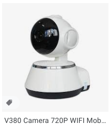
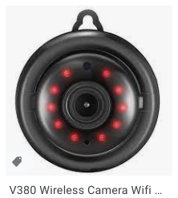

## Anyka AK3918E camera (OUCAM)

There are 3 models of the OUCAM so far, P1 P2 and an outdoor model that's no longer sold. They are all based on the Anyka AK3918E platform like many of these P2P cameras. They are set up and managed with the [OUCAM app](https://play.google.com/store/apps/details?id=cn.JK.P2PNetCamDv.oucam&hl=en_US&gl=US), but then operate like any other P2P camera.

| Model   | External image                | Inside                    |
|---------|-------------------------------|---------------------------|
| P1      |       |  |
| P2      |       |  |
| Outdoor |  | None                                           |

These cameras seem similar the "v380" or "A9" cameras available everywhere for US$20.





### Platform

Detailed at [anyka's website](http://www.anyka.com/en/productInfo.aspx?id=109), and in the [specs](http://monitor.espec.ws/files/700cafec77419c2d7705f376c974b8d0ff72_986.pdf).

See also https://github.com/HoffmannP/Camera and https://gist.github.com/maxious/c8915a436b532ab09e61bf937295a5d2.

#### Features

CPU
* ARM926EJ-S core
* Memory Management Unit (MMU)

Camera Interface
* Supports 8/10/12-bit Raw YUV CMOS image sensors
* Compatible with BT.601 protocol
* Programmable capture frame-rate

Image Signal Processor (ISP)
* 3A (AE, AWB, AF)
* Gamma correction, color enhancement, and edge sharpening
* DPC, denoising, and false color suppression
* Lens correction, lens shape correction
* 2D/ 3D Noise Reduction
* Wide dynamic range（WDR)

Video Pre-processor
* Supports cut window
* Supports image scaling
* Supports On-screen Display (OSD) and timestamp
* Supports Privacy Mask

Video Encoder
* H.264 encoder
* JPEG encoder
* Supports dual streams output

ADC/DAC
* Sigma-Delta ADC for voice/music recording
* Sigma-Delta DAC for mono audio playback
* SAR ADC for battery voltage measurement, keypad, and general analog-to-digital conversion

Memory
* On-chip DDR2 SDRAM

Hardware Encryption
* AES, DES and 3DES engine

Ethernet MAC
* MII/RMII Interface
* 10/100Mbps, full-duplex mode

Peripheral Interfaces
* USB 2.0 Host & Slave
* TWI
* I2S
* SPI
* UART
* MMC/SD/SDIO
* PWM

Operating Voltage
* Core 1.2V
* I/O 3.3V
* DDR2 SDRAM 1.8V

Package
* QFNL80, ELQFP128

## Boot

Bootup and wifi association takes about 30seconds.

AK39 clocks: CPU 400MHz, MEM 200MHz, ASIC 100MHz

```
[root@anyka ~]$ cat /proc/cpuinfo
Processor       : ARM926EJ-S rev 5 (v5l)
BogoMIPS        : 199.06
Features        : swp half fastmult edsp java 
CPU implementer : 0x41
CPU architecture: 5TEJ
CPU variant     : 0x0
CPU part        : 0x926
CPU revision    : 5

Hardware        : Cloud39E_AK3918E+H42_V1.0.2
Revision        : 0000
Serial          : 0000000000000000
```

```
[root@anyka ~]$ cat /proc/version 
Linux version 3.4.35 (root@ubuntu) (gcc version 4.4.1 (Sourcery G++ Lite 2009q3-67) ) #25 Tue Nov 19 14:00:09 HKT 2019
-AKV_2.1.06
```

No FPU.

40MB memory, not sure what the mem=64m kernel arg is for...

Anyka software versions (anyka_ipc) I have:
* P1 model is 3.3.56
* P2 model is 3.3.5.2

The version of the camera is stored in `/etc/jffs2/anyka_cfg.ini` as `soft_version`.

Between the models I found slight differences in important files:

P1 model (round)
```
64615ca2c0c7133a199b675820c3143e  /etc/jffs2/isp_h62_qq.conf
7c22c5f7a5cd388cfd96fd8ae3e36178  /usr/bin/daemon
0e15052675fe0d0ddfc177c45cf020d6  /usr/sbin/anyka_ipc.sh
3049ef075964bde69b75218811d3b645  /usr/bin/anyka_ipc
```

P2 model (square)
```
64615ca2c0c7133a199b675820c3143e  /etc/jffs2/isp_h62_qq.conf
7c22c5f7a5cd388cfd96fd8ae3e36178  /usr/bin/daemon
0e15052675fe0d0ddfc177c45cf020d6  /usr/sbin/anyka_ipc.sh
bc6d796598f3520886e505cbf9177a67  /usr/bin/anyka_ipc
```

The P2 model doesn't seem to go into ircut mode automatically even when `ircut_mode = 0` (auto), which is the same as the setting on my P1s.

## Main binaries
[`daemon`](https://github.com/jingwenyi/SmartCamera/tree/master/source/daemon)
[`anyka_ipc`](https://github.com/jingwenyi/SmartCamera/tree/master/source/anyka_ipc)

Daemon actually uses more memory than anyka_ipc

```
    PID  PPID USER     STAT   VSZ %VSZ CPU %CPU COMMAND
  437     1 root     S    95164259.0   0 12.0 anyka_ipc
  528     2 root     SW       0  0.0   0  3.9 [aec task]
  478     2 root     SW       0  0.0   0  2.7 [ksdioirqd/mmc1]
 1295     2 root     SW       0  0.0   0  0.5 [kworker/0:2]
  358     1 root     S     3104  8.4   0  0.3 telnetd
 7545  7539 root     R     3020  8.2   0  0.3 top
  443     1 root     S     3016  8.2   0  0.1 {wifi_run.sh} /bin/sh /usr/sbin/wifi_run.sh
  530     2 root     SW       0  0.0   0  0.1 [RTW_XMIT_THREAD]
  447     1 root     S    10660 29.0   0  0.0 daemon
```

Both `daemon` and `anyka_ipc` appear to have special handlers for `SIGUSR1` and `SIGUSR2` for re-reading config files, etc.

## Meaning of status light
* Fast green flash - bootup sequence, and unable to reach configured AP (hotspot should be active)
* Slow green flash - connected to wifi, normal operation
* Steady red - charging/plugged in
* Slow red flash - hung

## Caveat for setting up with OUCAM on Android 11
If a wifi network like the camera hotspot is not able to reach the internet, the phone will default to the LTE network. You must turn off mobile data to force the app to use the hotspot AP network.

## Battery
Internal 280mah battery lasts about 45mins, status can be read at `/sys/class/power_supply/battery/capacity` in percentage and is appended to the logs as well:

```
dmesg:
battery:cap=49; vol=3746; status=discharge; full=0; poweroff_cap=0; low_cap=5.
AK Battery initialized
```

## Watchdog
Set to 5 seconds (I believe), `daemon` is responsible for echoing into /tmp/daemon_fifo.

Stop the watchdog using `killall -12 daemon`.

### Telnet
Device has telnet enabled by default on default port 23, started from /etc/inittab. There is a root password with hash `$1$yu6zTMnb$FihN9mooEpO3CwLutNZPD1`. The password is not easily cracked. See the following section on setting your own root password over FTP.

### Netstat

```
[root@anyka ~]$ netstat -pan
Active Internet connections (servers and established)
Proto Recv-Q Send-Q Local Address           Foreign Address         State       PID/Program name    
tcp        0      0 0.0.0.0:6789            0.0.0.0:*               LISTEN      452/daemon
tcp        0      0 0.0.0.0:21              0.0.0.0:*               LISTEN      370/tcpsvd
tcp        0      0 0.0.0.0:23              0.0.0.0:*               LISTEN      356/telnetd
tcp        0      0 192.168.16.165:23       192.168.16.115:45342    ESTABLISHED 356/telnetd
tcp        0      0 127.0.0.1:23            127.0.0.1:48265         TIME_WAIT   -
tcp        0      0 192.168.16.165:23       192.168.16.115:45340    ESTABLISHED 356/telnetd
udp        0      0 0.0.0.0:8192            0.0.0.0:*                           452/daemon
udp        0      0 0.0.0.0:32761           0.0.0.0:*                           441/anyka_ipc
udp        0      0 0.0.0.0:51455           0.0.0.0:*                           441/anyka_ipc
Active UNIX domain sockets (servers and established)
Proto RefCnt Flags       Type       State         I-Node PID/Program name    Path
unix  5      [ ]         DGRAM                        83 371/syslogd         /dev/log
unix  2      [ ]         DGRAM                       394 597/wpa_supplicant  /var/run/wpa_supplicant/wlan0
unix  2      [ ]         DGRAM                       225 441/anyka_ipc       
unix  2      [ ]         DGRAM                       214 452/daemon          
unix  2      [ ]         DGRAM                        86 372/klogd   
```

### Cron
There is no cron on the device, periodic events are triggered from dedicated threads in `/usr/bin/anyka_ipc`.

### FTP
Anonymous FTP with root access is enabled on default port 21, the entire filesystem save squashfs is writable. Started from `/etc/init.d/rc.local`.

`/usr/bin/tcpsvd 0 21 ftpd -w / -t 600 &`

Use this to overwrite `/etc/jffs2/shadow` with new credentials. See the section on changing the root password.

Images can be transferred from the SD card (over wifi) at `/mnt/alarm_record_dir` over FTP

## Motion detection

The meat of the motion detection seems to happen in a binary blob, `/usr/lib/libakmotiondetectlib.so.0.1.0` through the `Motion_Detector_Open` function.

The tunable params are the "ratio" of changed pixels, and the number of sections the frame is divided into. Set in `/etc/jffs2/anyka_cfg.ini` (`motion_size_x` and `motion_size_y`).

## Alarm app push alerts

```
[root@anyka ~]$ strings /usr/bin/anyka_ipc |grep curl
/usr/bin/curl -s "http://oucam0.jkgeek.com:8088/OuCamRaise/server.php?cmd=raisealarm&devid=%s&eventtype=%d&eventtime=%lu"
```

### Change root password

mkpasswd -S yu6zTMnb --method=md5
  
1. ftp get ftp://:@[ip address]/etc/jffs/shadow
1. replace hash in shadow
1. ftp put shadow ftp://:@[ip address]/etc/jffs/shadow

Changes are immediate.

### Wifi
At startup, reads `/etc/jffs2/anyka_cfg.ini` for wifi config.

How does hotspot get value of TUTK id? Unknown. The only place it's stored on the device is `/etc/jffs/tutk.conf`.

Wifi performance is about 900Kbps sustained.

MAC manufacturer seems to be `44:01:bb:XX:XX:XX` or ?? but it's just the MAC of the Realtek RTL8188E "daughterboard".

```
[root@anyka /mnt]$ ip a
1: lo: <LOOPBACK,UP,LOWER_UP> mtu 16436 qdisc noqueue 
    link/loopback 00:00:00:00:00:00 brd 00:00:00:00:00:00
    inet 127.0.0.1/8 scope host lo
2: wlan0: <BROADCAST,MULTICAST,UP,LOWER_UP> mtu 1500 qdisc mq qlen 1000
    link/ether 44:01:bb:e8:be:c8 brd ff:ff:ff:ff:ff:ff
    inet 192.168.141.110/24 brd 192.168.141.255 scope global wlan0
3: wlan1: <BROADCAST,MULTICAST> mtu 1500 qdisc mq qlen 1000
    link/ether 46:01:bb:e8:be:c8 brd ff:ff:ff:ff:ff:ff
    inet 192.168.10.1/24 brd 192.168.10.255 scope global wlan1
```
    
We can likely provide a hostname to the router (local DNS resolution), by rebuilding the squashfs with:

```
/usr/sbin/wifi_ap.sh:   udhcpd /etc/udhcpd.conf #for busybox
/usr/sbin/wifi_ap.sh:   udhcpd /etc/udhcpd.conf -H cameraname #for busybox
```

#### AP hotspot
`ap_start()` function in `/usr/sbin/wifi_ap.sh`

Started when the camera cannot connect to configured hotspot. The SSID is the P2P UID on the back of the camera. The IP of the camera will be 192.168.10.1.

### Date and time
Received via NTP using TUTK...

```
Jan  1 08:00:35 anyka user.debug anyka_ipc: *******************tutk_ntp_time*******************
```

### Updating
Updater script appears able to use local, or remote firmware sources. `/usr/sbin/update.sh` calls `/bin/updater` which has [source available](https://github.com/jingwenyi/SmartCamera/tree/master/source/updater).

```
[root@anyka /usr/sbin]$ grep updater ./*.sh
./update.sh:            updater local K=${DIR1}/${VAR1}
./update.sh:            updater local MTD2=${DIR1}/${VAR3}
./update.sh:            updater local MTD3=${DIR1}/${VAR4}
./update.sh:            updater local MTD1=${DIR1}/${VAR2}
```

## P2P
The camera is assigned a serial number in `/etc/jffs/tutk.conf` and uses the ThroughTek Kalay P2P network, and thus works with a variety of apps like [tinyCam](https://play.google.com/store/apps/details?id=com.alexvas.dvr.pro&hl=en_US&gl=US) (better). This works by hijacking a UDP NAT connection that's made outbound from the camera. So it traverses firewalls.

The `daemon` binary manages the P2P connection and inbound requests, etc.

### Camera/sensor
Files in `/etc/jffs2/` like `isp_h62_qq.conf`. They are binary files but have strings for things like changing saturation and exposure. Unknown how to rebuild them or change the camera settings.

ISP = Image Signal Processor?

### strace


### dropbear
Dropbear can be started at startup from `/etc/inittab` or `/etc/init.d/rcS` or `/etc/init.d/rc.local` and rebuilding squashfs and writing it back to /dev/mtdX devices.

./dropbear -r ./dropbear_rsa_host_key -F -E

### SPI/Flash (MTD)
```
Jan  1 00:00:05 anyka user.warn kernel: Start to init Anyka SPI Flash...
Jan  1 00:00:05 anyka user.warn kernel: AK SPI Driver, (c) 2012 ANYKA
Jan  1 00:00:05 anyka user.warn kernel: akpi regs: SPICON:00000152, SPISTA:00000015, SPIINT:00000000.
Jan  1 00:00:05 anyka user.info kernel: ak-spi ak-spi: master is unqueued, this is deprecated
Jan  1 00:00:05 anyka user.warn kernel: ak_spi setup the master.
Jan  1 00:00:05 anyka user.warn kernel: pre-scaler=2 (wanted 20Mhz, got 16Mhz)
Jan  1 00:00:05 anyka user.warn kernel: ak spiflash probe enter.
Jan  1 00:00:05 anyka user.warn kernel: pre-scaler=2 (wanted 20Mhz, got 16Mhz)
Jan  1 00:00:05 anyka user.warn kernel: ak_spi_setupxfer,con:00000252.
Jan  1 00:00:05 anyka user.warn kernel: akspi flash ID: 0x001c7017
Jan  1 00:00:05 anyka user.warn kernel: PN26f64B, info->sector_size = 65536, info->n_sectors = 128
Jan  1 00:00:05 anyka user.info kernel: ak-spiflash spi0.0: PN26f64B (8192 Kbytes)
Jan  1 00:00:05 anyka user.warn kernel: FHA:fhalib V1.0.25^M
Jan  1 00:00:05 anyka user.warn kernel: FHA:FHA_S SPIFlash_Init: BinPageStartblock:35,^M
Jan  1 00:00:05 anyka user.warn kernel: FHA:FHA_S SPIFlash_Init: BinPageStart:560,^M
Jan  1 00:00:05 anyka user.warn kernel: FHA:FHA_S G_P_S:558 
Jan  1 00:00:05 anyka user.warn kernel: nr_parts=0x3
Jan  1 00:00:05 anyka user.warn kernel: mtd_part[0]:
Jan  1 00:00:05 anyka user.warn kernel: name = A
Jan  1 00:00:05 anyka user.warn kernel: size = 0x200000
Jan  1 00:00:05 anyka user.warn kernel: offset = 0x260000
Jan  1 00:00:05 anyka user.warn kernel: mask_flags = 0x0
Jan  1 00:00:05 anyka user.warn kernel: mtd_part[1]:
Jan  1 00:00:05 anyka user.warn kernel: name = B
Jan  1 00:00:05 anyka user.warn kernel: size = 0x300000
Jan  1 00:00:05 anyka user.warn kernel: offset = 0x460000
Jan  1 00:00:05 anyka user.warn kernel: mask_flags = 0x0
Jan  1 00:00:05 anyka user.warn kernel: mtd_part[2]:
Jan  1 00:00:05 anyka user.warn kernel: name = C
Jan  1 00:00:05 anyka user.warn kernel: size = 0x50000
Jan  1 00:00:05 anyka user.warn kernel: offset = 0x760000
Jan  1 00:00:05 anyka user.warn kernel: mask_flags = 0x0
Jan  1 00:00:05 anyka user.notice kernel: Creating 3 MTD partitions on "spi0.0":
Jan  1 00:00:05 anyka user.notice kernel: 0x000000260000-0x000000460000 : "A"
Jan  1 00:00:05 anyka user.notice kernel: 0x000000460000-0x000000760000 : "B"
Jan  1 00:00:05 anyka user.notice kernel: 0x000000760000-0x0000007b0000 : "C"
Jan  1 00:00:05 anyka user.warn kernel: Init AK SPI Flash finish.
Jan  1 00:00:05 anyka user.warn kernel: akspi master initialize success, use for DMA mode.
```

```
$ md5sum mtdblock*
386ecedcf6b88cbcf447779d8e506429  mtdblock0
ba5d67858fa77a334a1c6edc736185da  mtdblock1
dac8ddaae01e25ce8ec62904c9187d74  mtdblock2
a50fbe4a09276c84d9202828c1e668dc  mtdblock3
```

```
$ unsquashfs -s mtdblock2
Found a valid SQUASHFS 4:0 superblock on mtdblock2.
Creation or last append time Fri Apr 10 18:42:37 2020
Filesystem size 2428.55 Kbytes (2.37 Mbytes)
Compression xz
Block size 131072
Filesystem is exportable via NFS
Inodes are compressed
Data is compressed
Fragments are compressed
Always-use-fragments option is not specified
Xattrs are compressed
Duplicates are removed
Number of fragments 18
Number of inodes 249
Number of ids 1
```

* mtdblock1 is `/`
* mtdblock2 is `/usr`

```
[root@anyka /mnt]$ dd /dev/mtd
mtd0       mtd1       mtd2       mtd3       mtdblock0  mtdblock2
mtd0ro     mtd1ro     mtd2ro     mtd3ro     mtdblock1  mtdblock3
[root@anyka /mnt]$ dd if=/dev/mtdblock1 of=./mtdblock1
4096+0 records in
4096+0 records out
2097152 bytes (2.0MB) copied, 6.449022 seconds, 317.6KB/s
[root@anyka /mnt]$ dd if=/dev/mtdblock0 of=./mtdblock0
16384+0 records in
16384+0 records out
8388608 bytes (8.0MB) copied, 24.628146 seconds, 332.6KB/s
[root@anyka /mnt]$ dd if=/dev/mtdblock2 of=./mtdblock2
6144+0 records in
6144+0 records out
3145728 bytes (3.0MB) copied, 11.208962 seconds, 274.1KB/s
[root@anyka /mnt]$ dd if=/dev/mtdblock3 of=./mtdblock3
640+0 records in
640+0 records out
327680 bytes (320.0KB) copied, 0.830226 seconds, 385.4KB/s
```

### Busybox applets

```
BusyBox v1.20.2 (2015-04-17 19:54:22 CST) multi-call binary.

Currently defined functions:
        [, [[, acpid, adduser, adjtimex, arp, arping, ash, awk, base64, basename, beep, blockdev,
        bootchartd, brctl, cal, cat, catv, chat, chmod, chown, chroot, chrt, chvt, cksum, clear,
        cmp, cp, crontab, cryptpw, cttyhack, cut, date, dc, dd, depmod, devmem, df, dhcprelay,
        diff, dirname, dmesg, dnsdomainname, dos2unix, du, dumpkmap, dumpleases, echo, egrep,
        eject, env, expand, expr, fakeidentd, false, fbset, fbsplash, fgconsole, fgrep, find,
        fold, free, fsync, ftpd, ftpget, ftpput, fuser, getopt, getty, grep, groups, halt, hd,
        head, hexdump, hostid, hostname, hwclock, id, ifconfig, ifdown, ifenslave, ifplugd, ifup,
        inetd, init, inotifyd, insmod, install, ionice, iostat, ip, ipaddr, ipcalc, ipcrm, ipcs,
        iplink, iproute, iprule, iptunnel, kbd_mode, kill, killall, killall5, klogd, less,
        linux32, linux64, linuxrc, ln, loadfont, loadkmap, logger, login, logname, logread,
        losetup, ls, lsmod, lsof, lspci, lsusb, makedevs, md5sum, mdev, mesg, mkdir, mkdosfs,
        mkfifo, mkfs.vfat, mknod, mkpasswd, modinfo, modprobe, more, mount, mountpoint, mv,
        nameif, nanddump, nandwrite, nbd-client, nc, netstat, nice, nslookup, ntpd, od, passwd,
        pgrep, pidof, ping, pivot_root, pkill, pmap, poweroff, powertop, printenv, printf, ps,
        pscan, pstree, pwd, pwdx, rdate, rdev, readahead, readlink, readprofile, realpath,
        reboot, renice, reset, resize, rm, rmdir, rmmod, route, rtcwake, rx, script,
        scriptreplay, sed, setarch, setconsole, setfont, setkeycodes, setlogcons, setserial,
        setsid, sh, sha1sum, sha256sum, sha512sum, showkey, slattach, sleep, smemcap, sort,
        split, stat, strings, stty, sum, switch_root, sync, sysctl, syslogd, tail, tar, tcpsvd,
        tee, telnet, telnetd, test, tftp, tftpd, time, timeout, top, touch, traceroute, true,
        tty, tunctl, ubiattach, ubidetach, ubimkvol, ubirmvol, ubirsvol, ubiupdatevol, udhcpc,
        udhcpd, udpsvd, umount, uname, uncompress, unix2dos, uptime, usleep, uudecode, uuencode,
        vconfig, vi, volname, watch, watchdog, wc, which, whoami, whois, xargs, yes
```

#### Busybox applets not mapped

```
[root@anyka ~]$ for applet in $(busybox --list); do if [ ! $(which $applet) ]; then echo $applet; 
fi; done
adduser
cryptpw
linuxrc
mkpasswd
```

## More info about binaries
help string for anyka_ipc or daemon? No
version string is in system log?

irledlevel in strings seems to indicate variability in brightness of IR leds

Setting `debug = 1` in `/etc/jffs2/anyka_cfg.ini` results in a lot of useful info in `/var/log/messages`

### Settings management
Standard P2P API calls, see https://github.com/6Six/CameraMonitor_iOS/blob/master/IOTCameraLib/iOS/Debug-iphoneos/IOTCamera.framework/Headers/AVIOCTRLDEFs.h
```
[root@anyka /mnt]$ strings /usr/bin/anyka_ipc |grep IOTYPE_USER_IPCAM_
IOTYPE_USER_IPCAM_START, ch:%d, avIndex:%d
IOTYPE_USER_IPCAM_STOP, ch:%d, avIndex:%d
IOTYPE_USER_IPCAM_AUDIOSTART, ch:%d, avIndex:%d
IOTYPE_USER_IPCAM_AUDIOSTOP, ch:%d, avIndex:%d
IOTYPE_USER_IPCAM_SPEAKERSTART, ch:%d, avIndex:%d
IOTYPE_USER_IPCAM_SPEAKERSTOP
IOTYPE_USER_IPCAM_DEVINFO_REQ
IOTYPE_USER_IPCAM_SETPASSWORD_REQ
IOTYPE_USER_IPCAM_SET_TIMEZONE_REQ
IOTYPE_USER_IPCAM_GET_TIMEZONE_REQ
IOTYPE_USER_IPCAM_GETAUDIOOUTFORMAT_REQ
IOTYPE_USER_IPCAM_SETSTREAMCTRL_REQ
IOTYPE_USER_IPCAM_GETSTREAMCTRL_REQ
IOTYPE_USER_IPCAM_PTZ_COMMAND
IOTYPE_USER_IPCAM_SET_VIDEOMODE_REQ
IOTYPE_USER_IPCAM_GET_VIDEOMODE_REQ
IOTYPE_USER_IPCAM_LISTWIFIAP_REQ
IOTYPE_USER_IPCAM_SETWIFI_REQ
IOTYPE_USER_IPCAM_GETWIFI_REQ
IOTYPE_USER_IPCAM_SETWIFI_REQ_2
IOTYPE_USER_IPCAM_SETMOTIONDETECT_REQ
IOTYPE_USER_IPCAM_GETMOTIONDETECT_REQ
IOTYPE_USER_IPCAM_SETRECORD_REQ
IOTYPE_USER_IPCAM_GETRECORD_REQ
IOTYPE_USER_IPCAM_LISTEVENT_REQ
IOTYPE_USER_IPCAM_RECORD_PLAYCONTROL cmd[%d]
IOTYPE_USER_IPCAM_FORMATEXTSTORAGE_REQ
IOTYPE_USER_IPCAM_SET_TIME_SYNC_REQ
IOTYPE_USER_IPCAM_RESET_DEVICE_REQ
IOTYPE_USER_IPCAM_THIRDPART_SETTING_REQ
IOTYPE_USER_IPCAM_SET_IRLED_REQ
AVAPI2_StopRecvAudio [%d] AVAPI2_SendIOCtrl(IOTYPE_USER_IPCAM_AUDIOSTOP) ret[%d]
AVAPI2_StartRecvAudio [%d] AVAPI2_SendIOCtrl(IOTYPE_USER_IPCAM_AUDIOSTART) ret[%d]
AVAPI2_StartRecvFrame [%d] AVAPI2_StopRecvFrame(IOTYPE_USER_IPCAM_STOP) ret[%d]
AVAPI2_StartRecvFrame [%d] AVAPI2_SendIOCtrl(IOTYPE_USER_IPCAM_START) ret[%d]
```

### Configure device from sdcard
There seem to be some magic files for configuring the camera:

```
/tmp/ircut_test
/tmp/ak_sys_start_flag
/tmp/eth.test
/tmp/anyka_ipc_run
/tmp/tmp.txt
/mnt/wifi_set.txt # set up wifi from the sd card?
/mnt/tutk_sn.txt # sets serial number?
/mnt/test_config # unknown
```

Not sure how to trigger them. Would be great to know how to configure wifi from SD card for example.

```
[root@anyka /mnt]$ strings /usr/bin/anyka_ipc|grep mnt
/mnt
mount | grep '/dev/mmcblk0p1 on /mnt'
mount | grep '/dev/mmcblk0 on /mnt'
/mnt/tmp/
/mnt/tmp/anyka_video_record_1
/mnt/tmp/anyka_video_record_2
/mnt/tmp/anyka_video_index_1
/mnt/tmp/anyka_video_index_2
/mnt/pic/
/mnt/zImage.%u
/mnt/usr.sqsh4.%u
/mnt/root.sqsh4.%u
/mnt/usr.jffs2.%u
/mnt/wifi_set.txt
/mnt/alarm_record_dir/
/mnt/CYC_DV/
/mnt/record/
/mnt/tmp/alarm_record_file_1
/mnt/tmp/alarm_record_file_2
/mnt/tmp/alarm_record_index_1
/mnt/tmp/alarm_record_index_2
/mnt/test_config
umount -l /mnt
mount /dev/mmcblk0p1 /mnt
mount /dev/mmcblk0 /mnt
[%s:%d] *** mount the sd on /mnt ***
umount /mnt/
rm -rf /mnt/*
mount /dev/mmcblk0p1 /mnt/
mount /dev/mmcblk0 /mnt/
```

```
[root@anyka /mnt]$ strings /usr/bin/anyka_ipc|grep mmcblk
mount | grep '/dev/mmcblk0p1 on /mnt'
[%s:%d] remount /dev/mmcblk0p1
mount -o remount,rw /dev/mmcblk0p1
mount | grep '/dev/mmcblk0 on /mnt'
[%s:%d] remount /dev/mmcblk0
mount -o remount,rw /dev/mmcblk0
mount /dev/mmcblk0p1 /mnt
mount /dev/mmcblk0 /mnt
mkfs.vfat /dev/mmcblk0p1
mount /dev/mmcblk0p1 /mnt/
mkfs.vfat /dev/mmcblk0
mount /dev/mmcblk0 /mnt/
[root@anyka /mnt]$ strings /usr/bin/daemon|grep mmcblk
/dev/mmcblk0p1
/dev/mmcblk0
**********we will skip mount /dev/mmcblk0*******
mount -rw /dev/mmcblk0p1 /mnt
insmod /usr/modules/g_mass_storage.ko file=/dev/mmcblk0p1 removable=1 stall=0
insmod /usr/modules/g_mass_storage.ko file=/dev/mmcblk0 removable=1 stall=0
mount -rw /dev/mmcblk0 /mnt
```

```
[root@anyka /mnt]$ strings /usr/bin/anyka_ipc|grep wlan1
iwlist wlan1 scanning > %s
ifconfig wlan1| grep RUNNING
[root@anyka /mnt]$ strings /usr/bin/anyka_ipc|grep wlan0
iwlist wlan0 scanning > %s
wlan0
ifconfig wlan0 | grep RUNNING
ifconfig wlan0 | grep inet
```

```
[root@anyka /mnt]$ strings /usr/bin/anyka_ipc|grep ircut
camera_ircut_pthread
ircut_mode
camera_ircut_pthread
/tmp/ircut_test
ircut set day
ircut set night
```

## Video files
/tmp/alarm.list has a list of all files in /mnt/alarm_record_dir

```
file:/mnt/alarm_record_dir/VIDEO_ALARM_CYC_DV_20210725-065900.avi;start:1627196340;time:302
file:/mnt/alarm_record_dir/VIDEO_ALARM_CYC_DV_20210725-070402.avi;start:1627196642;time:302
```

## Reverse binary
```
$ binwalk mtdblock1

DECIMAL       HEXADECIMAL     DESCRIPTION
--------------------------------------------------------------------------------
0             0x0             Squashfs filesystem, little endian, version 4.0, compression:xz, size: 1930074 bytes, 207 inodes, blocksize: 131072 bytes, created: 2020-04-11 01:42:34

$ binwalk mtdblock2

DECIMAL       HEXADECIMAL     DESCRIPTION
--------------------------------------------------------------------------------
0             0x0             Squashfs filesystem, little endian, version 4.0, compression:xz, size: 2486832 bytes, 249 inodes, blocksize: 131072 bytes, created: 2020-04-11 01:42:37

$ binwalk mtdblock3

DECIMAL       HEXADECIMAL     DESCRIPTION
--------------------------------------------------------------------------------
0             0x0             JFFS2 filesystem, little endian
6424          0x1918          Unix path: /var/run/hostapd
8192          0x2000          JFFS2 filesystem, little endian
8868          0x22A4          JFFS2 filesystem, little endian
9316          0x2464          JFFS2 filesystem, little endian
9576          0x2568          JFFS2 filesystem, little endian
9776          0x2630          JFFS2 filesystem, little endian
33460         0x82B4          Unix path: /var/run/hostapd
35624         0x8B28          JFFS2 filesystem, little endian
53248         0xD000          JFFS2 filesystem, little endian
61324         0xEF8C          Unix path: /var/run/hostapd
61452         0xF00C          JFFS2 filesystem, little endian
123072        0x1E0C0         Unix path: /var/run/hostapd
126260        0x1ED34         JFFS2 filesystem, little endian
195452        0x2FB7C         JFFS2 filesystem, little endian
259152        0x3F450         Unix path: /var/run/hostapd
261296        0x3FCB0         JFFS2 filesystem, little endian
261928        0x3FF28         Unix path: /var/run/hostapd
262144        0x40000         JFFS2 filesystem, little endian
314072        0x4CAD8         Unix path: /var/run/hostapd
315392        0x4D000         JFFS2 filesystem, little endian
```
## Manufacturer support

There are several email addresses written on the paper instructions included with the cameras: oucam888@gmail.com, fecomisupport@163.com
